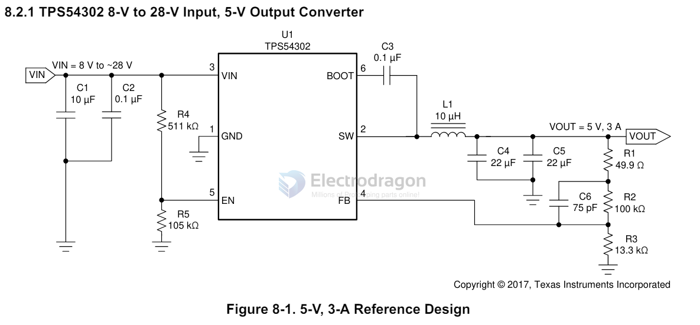

# TI-power

## TPS54302 

| Parts | Common Value | Note |
| ----- | ------------ | ---- |
| Cin   | 10+0.1       |      |
| Cboot | 0.1          |      |
| Lo    | 10uh         |      |
| Rfb1  | 100K         |      |
| Rfb2  | 13.3K        |      |
| Cfb   | 75pf         |      |
| Co    | 22uf x2      |      |

Vout = Vref * (R2/R3+1)

for 5V = 0.6V * (100K / ? + 1 )

100K / R3 = 5V/0.6V - 1 = 7.3333
100K / R3 = 5.2V/0.6V - 1 = 7.6666

R3 = 13.633K or below 13.3K for 5.2V

