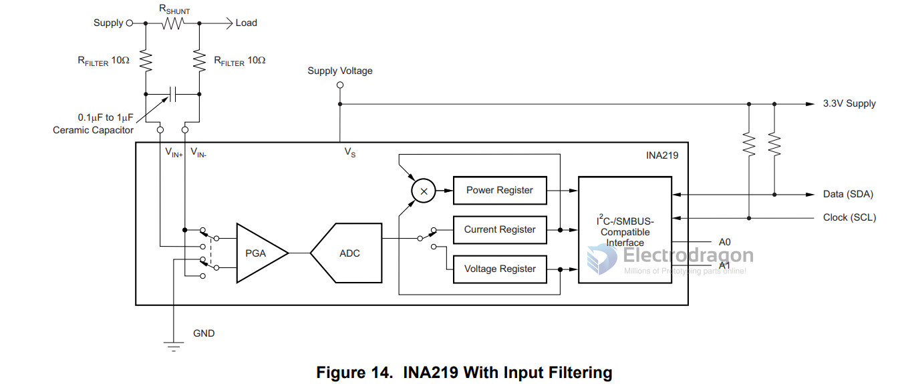

# INA219 

INA219 is a high-side voltage and current sensor that communicates over I2C. It can measure voltage up to 26V and current up to 3.2A with a resolution of 0.8mV and 0.1mA respectively. It is commonly used in battery monitoring, power management, and current sensing applications.

The INA219 senses across shunts on buses that can vary from 0 to 26 V. The device uses a single 3- to 5.5-V supply, drawing a maximum of 1 mA of supply current

## Here are some useful links for INA219:

- Datasheet: https://www.ti.com/lit/ds/symlink/ina219.pdf
- Adafruit INA219 tutorial: https://learn.adafruit.com/adafruit-ina219-current-sensor-breakout
- Sparkfun INA219 hookup guide: https://learn.sparkfun.com/tutorials/ina219-current-sensor-hookup-guide
- Arduino library for INA219: https://github.com/adafruit/Adafruit_INA219

## SCH 

## ref 

- [[shunt-resistor-dat]] - [[power-meter-dat]] - [[INA226-dat]]