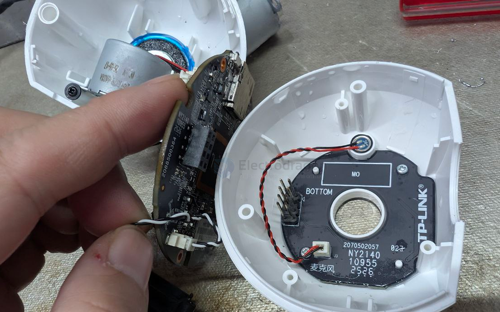
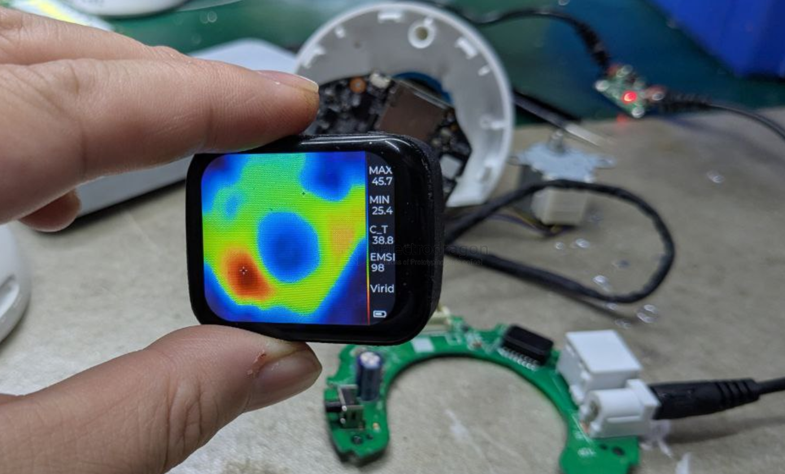

# TPLINK-dat

- [[TPlink-dat]] - [[TPLINK-T4U-dat]] - [[wifi-router-dat]]

- [[TPLINK-dat]] - [[TPLINK-T4U-dat]] - [[RTL8812-dat]]

## TPLINK router 

http://tplogin.cn/

http://192.168.1.1/

TL-XDR3010 易展版（AX3000 WiFi6）
- CPU：高通 IPQ0509 / IPQ0518（双核 1GHz + 单核 NPU）
- 内存：⭐️ 256MB（集成在 SoC 内，主板上看不到内存芯片）
- 闪存：16MB
- 2.4G：574Mbps（2×2）· 5G：2402Mbps（QCN9074）
- 网口：千兆 ×4
- 上市：2021 年 · 原价 ¥269
- 定位：⭐️ 入门级满血 WiFi6

🎯 它为什么会"久了就卡"

① 内存属入门级
256MB + 双核 1GHz = 够日常，但不算宽裕
        ↓
多设备 + BT 下载 + 视频流 + 智能家居 → 高负载
        ↓
⭐️ NAT 连接表堆积 + 内存吃紧 → 卡
（这正是"重启就好"的典型机制）

② ⭐️ 散热是这款的已知短板
搜索发现有人专门做「XDR3010 散热改造」视频
        ↓
说明原厂散热一般
        ↓
⭐️ 你在深圳（高温高湿）→ 这条要重视 ⚠️

③ 固件 1.0.14
需确认是否为最新版（TP-Link 会持续修 bug）

## TPLINK camera 

- [[stepper-dat]] 

[dissembled TP LINK security camera post ](https://www.electrodragon.com/teardown-a-tplink-security-camera-after-oil-soaking/)

## microphone and front leds 

## heat 

- [[Heat-Dissipation-dat]]

## ref 

- [[tplink]]