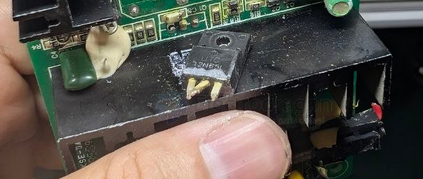

# UTC-dat

- [[mosfet-dat]] - [[voltage-high-dat]] - [[2N65L-dat]] - [[UTC-dat]]

The UTC `2N65L` is a 650V, 2A N-channel power MOSFET manufactured by `Unisonic Technologies` (UTC). 

It features fast switching times, low gate charge, and low on-state resistance, making it ideal for high-voltage applications like power supplies, DC-to-DC converters, and motor controls.

## ref 