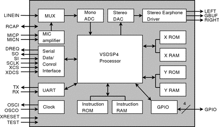

# VS1003-dat

## Info 
 
chip info, datasheet, etc.

- [datasheet](https://www.vlsi.fi/en/products/vs1003.html)

VS1003 is a versatile slave MP3 and WMA decoder chip, replacing the discontinued VS1002. 

It can record wideband speech quality audio and play MIDI either from files or using a standard serial MIDI keyboard with the Real-Time MIDI Input Application. 

Many wide-ranging applications have been developed for this IC that has sold more than 5 million units.

## App. 

- [[SSL1040-dat]]

## ref 
 
- [[VS1003]] 
 

