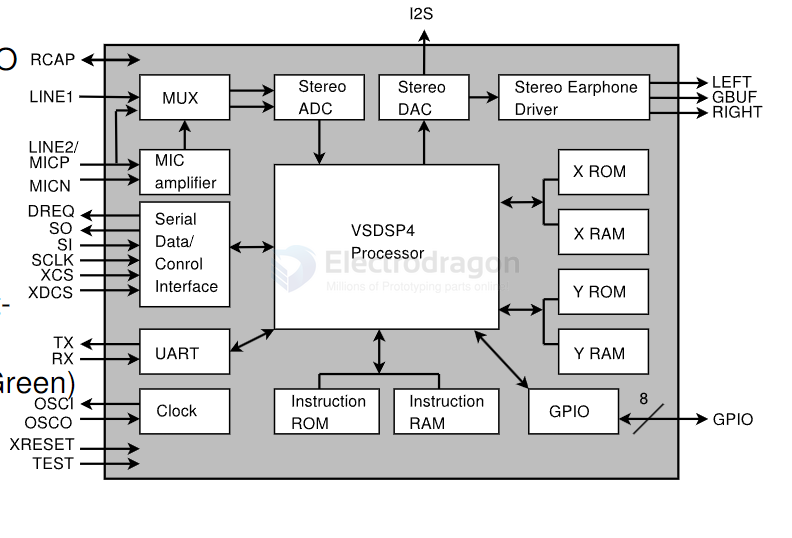
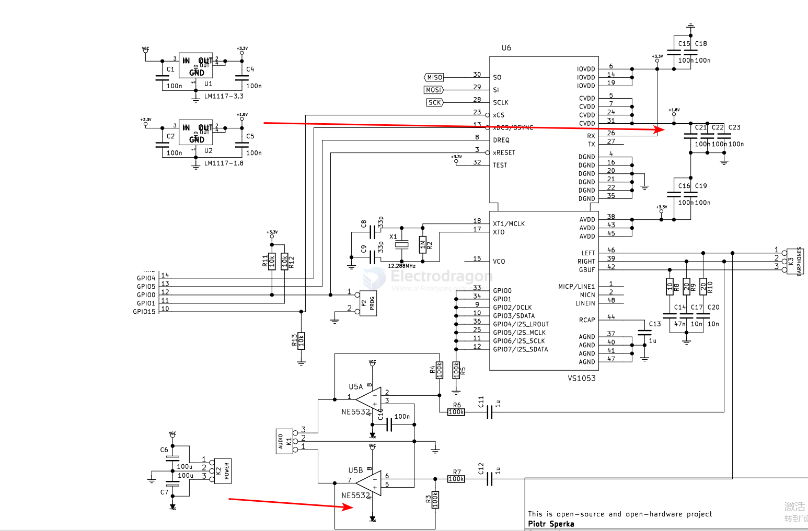

# VS1053-dat

## Info 
 
chip info - datasheet [[VS1053B-DS.pdf]]

Ogg Vorbis/MP3/AAC/WMA/FLAC/MIDI AUDIO CODEC CIRCUIT

## App. 

- [[codec-dat]] - [[mp3-decoder-dat]]
 

## SCH 

- [[NE5532-dat]]

## ref 

- [[I2S-dat]]
 
- [[VS1053]] 
 