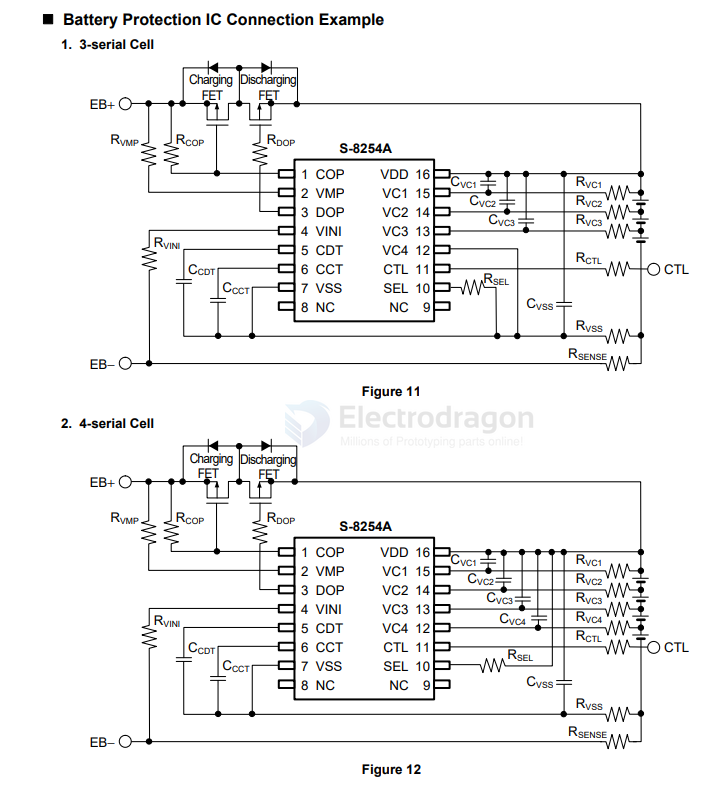
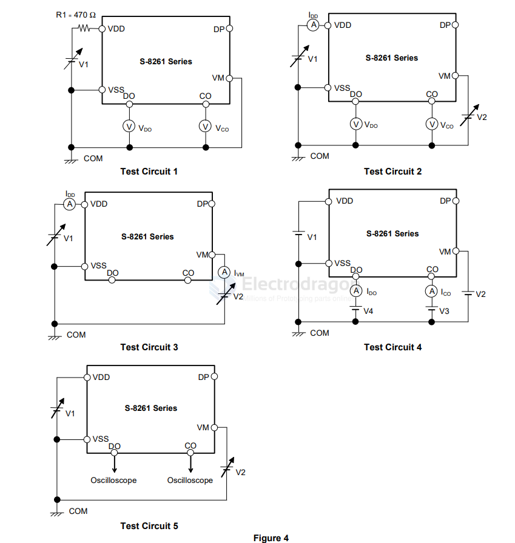

# ablic-dat.md

## S-8254A

S-8254A Series == [[battery-protector-3s-dat]] == version 2 

BATTERY PROTECTION IC FOR 3-SERIAL- OR 4-SERIAL-CELL PACK

https://www.ablic.com/en/doc/datasheet/battery_protection/S8254A_E.pdf

## 883A == S-8261 Series

- [[battery-1s-dat]] - [[ablic-dat]]

BATTERY PROTECTION IC FOR 1-CELL PACK

## ref 

- [[battery-protector-dat]]