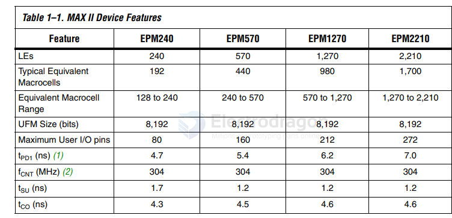

# EPM240-dat 

- [[EPM240-dat]] - [[EPM570-dat]] - [[altera-dat]] - [[DODS044]] - [[DODS044-dat]] - [[CPLD-dat]] - [[FPGA-dat]]

The MAX® II family of instant-on, non-volatile CPLDs is based on a 0.18-µm, 6-layer-metal-flash process, with densities from 240 to 2,210 logic elements (LEs) (128 to 2,210 equivalent macrocells) and non-volatile storage of 8 Kbits. MAX II devices offer high I/O counts, fast performance, and reliable fitting versus other CPLD architectures. Featuring MultiVolt™ core, a user flash memory (UFM) block, and enhanced in-system programmability (ISP), MAX II devices are designed to reduce cost and power while providing programmable solutions for applications such as bus bridging, I/O expansion, power-on reset (POR) and sequencing control, and device configuration control.

## ref 

