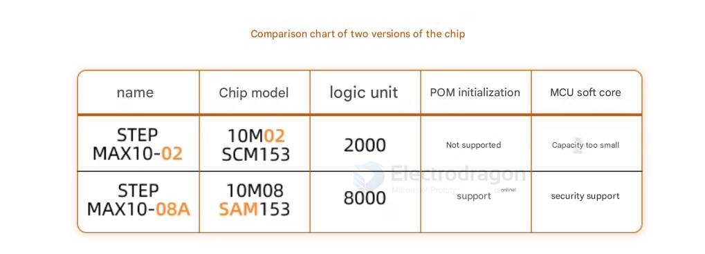

# altera-dat

hand book MAX II - [[max2_mii5v1.pdf]]

- [[MAX10-dat]]

## demo code 

- [[led_water(570).zip]]

## chip Versions

- 10M08SCM - MAX10 M08 SCM
- 10M02SCM
- 10M08SAM - MAX10 M08 SAM 153 - current

chip models note 
- 08SCM - 8K logic elements
- SC : Single supply - compact features
- M : Micro FineLine BGA (MBGA)
- 153: MBGA Package Type 153 : 153 pins, 8 mm x 8 mm
- C : Commercial (T = 0° C to 85° C)
- 8: FPGA Fabric Speed Grade
- G : RoHS6

## ALTERA10MO2SCM153

- Core device: ALTERA10MO2SCM153
- 153-pin BGA package, pin pitch 0.5MM, chip size 8MM*8MM;
- 2000 LE resources, 12KB user flash memory, 108KBIT RAM;
- Supports DDR2/DDR3L/DDR3/LPDDR2 memory;
- 16 hardware multipliers;
- 112 user GPIOs;
- 3.3V power supply;
- Instant-on at power-up;

On-board resources:

- Two RGB tri-color LEDs;
- 2 user LEDs;
- 4-channel DIP switch;
- 2 push buttons;
- 36 user-expandable I/O;
  - Supported development tool: ALTERA QUARTUS II;
  - One Type-C interface
  - One 10-PIN JTAG programming interface:
  - Board size 52MM×18MM

## ALTERA10M08SAM153

- Core device: ALTERA10M08SAM153
- 153-pin BGA package, pin pitch 0.5MM, chip size 8MMX8MM;
- 8000 LE resources, up to 172KB user flash memory, 378KBIT RAM;
- Supports DDR2/DDR3L/DDR3/LPDDR2 memory;
- 24 hardware multipliers;
- 112 user GPIOs;
- Instant-on at power-up;
- 3.3V power supply;
- 2 PLLs;

## ref 

- [[CPLD-dat]]

- [[FPGA]]