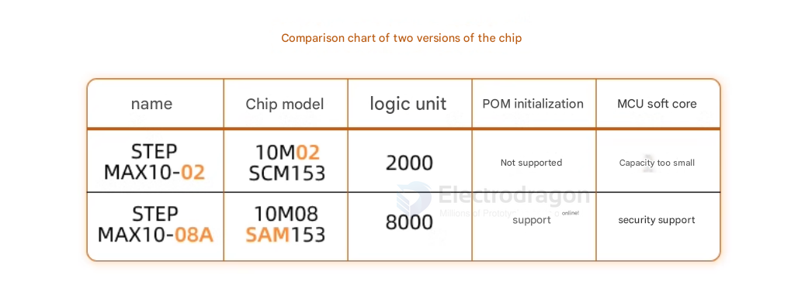

# altera-dat

- [[CPLD-dat]] - [[FPGA-dat]] - [[altera-dat]] 

- [[cypress-dat]] - [[Infineon-dat]] - [[pins003-dat]] - [[MCU-dat]]

- [[app-dat]] - [[logic-analyzer-dat]] - [[USB-blaster-dat]] - [[data-acquisition-board-dat]] - [[PINS003-dat]]

- [[JLINK-dat]] - [[FPGA-dat]] - [[CPLD-dat]] - [[Altera-dat]] - [[intel-dat]]

hand book MAX II - [[max2_mii5v1.pdf]]

- [[MAX10-dat]]

- [[EPM240-dat]] - [[EPM570-dat]] - [[altera-dat]] - [[DODS044]] - [[DODS044-dat]] - [[CPLD-dat]] - [[FPGA-dat]]

## EPM7192 

	
EPM7192SQI160-10 - IC CPLD 192MC 10NS 160QFP

Features... 
- ■ High-performance, EEPROM-based programmable logic devices (PLDs) based on second-generation MAX® architecture
- ■ 5.0-V in-system programmability (ISP) through the built-in IEEE Std. 1149.1 Joint Test Action Group (JTAG) interface available in MAX 7000S devices
  - – ISP circuitry compatible with IEEE Std. 1532
- ■ Includes 5.0-V MAX 7000 devices and 5.0-V ISP-based MAX 7000S devices
- ■ Built-in JTAG boundary-scan test (BST) circuitry in MAX7000S devices with 128 or more macrocells
- ■ Complete EPLD family with logic densities ranging from 600 to 5,000 usable gates (see Tables 1 and 2)
- ■ 5-ns pin-to-pin logic delays with up to 175.4-MHz counter frequencies (including interconnect)
- ■ PCI-compliant devices available

https://mm.digikey.com/Volume0/opasdata/d220001/medias/docus/987/MAX7000_Family_DS.pdf

## demo code 

- [[led_water(570).zip]]

The `MAX® II` family of instant-on, non-volatile CPLDs is based on a 0.18-µm, 6-layer-metal-flash process, with densities from 240 to 2,210 logic elements (LEs) (128 to 2,210 equivalent macrocells) and non-volatile storage of 8 Kbits. 

MAX II devices offer high I/O counts, fast performance, and reliable fitting versus other CPLD architectures. 

Featuring MultiVolt core, a user flash memory (UFM) block, and enhanced in-system programmability (ISP), MAX II devices are designed to reduce cost and power while providing programmable solutions for applications such as bus bridging, I/O expansion, power-on reset (POR) and sequencing control, and device configuration control.

## chip Versions

- 10M08SCM - MAX10 M08 SCM
- 10M02SCM
- 10M08SAM - MAX10 M08 SAM 153 - current

chip models note 
- 08SCM - 8K logic elements
- SC : Single supply - compact features
- M : Micro FineLine BGA (MBGA)
- 153: MBGA Package Type 153 : 153 pins, 8 mm x 8 mm
- C : Commercial (T = 0° C to 85° C)
- 8: FPGA Fabric Speed Grade
- G : RoHS6

## ALTERA10MO2SCM153

- Core device: ALTERA10MO2SCM153
- 153-pin BGA package, pin pitch 0.5MM, chip size 8MM*8MM;
- 2000 LE resources, 12KB user flash memory, 108KBIT RAM;
- Supports DDR2/DDR3L/DDR3/LPDDR2 memory;
- 16 hardware multipliers;
- 112 user GPIOs;
- 3.3V power supply;
- Instant-on at power-up;

On-board resources:

- Two RGB tri-color LEDs;
- 2 user LEDs;
- 4-channel DIP switch;
- 2 push buttons;
- 36 user-expandable I/O;
  - Supported development tool: ALTERA QUARTUS II;
  - One Type-C interface
  - One 10-PIN JTAG programming interface:
  - Board size 52MM×18MM

## ALTERA10M08SAM153

- Core device: ALTERA10M08SAM153
- 153-pin BGA package, pin pitch 0.5MM, chip size 8MMX8MM;
- 8000 LE resources, up to 172KB user flash memory, 378KBIT RAM;
- Supports DDR2/DDR3L/DDR3/LPDDR2 memory;
- 24 hardware multipliers;
- 112 user GPIOs;
- Instant-on at power-up;
- 3.3V power supply;
- 2 PLLs;

## ref 

- [[CPLD-dat]]

- [[FPGA]]