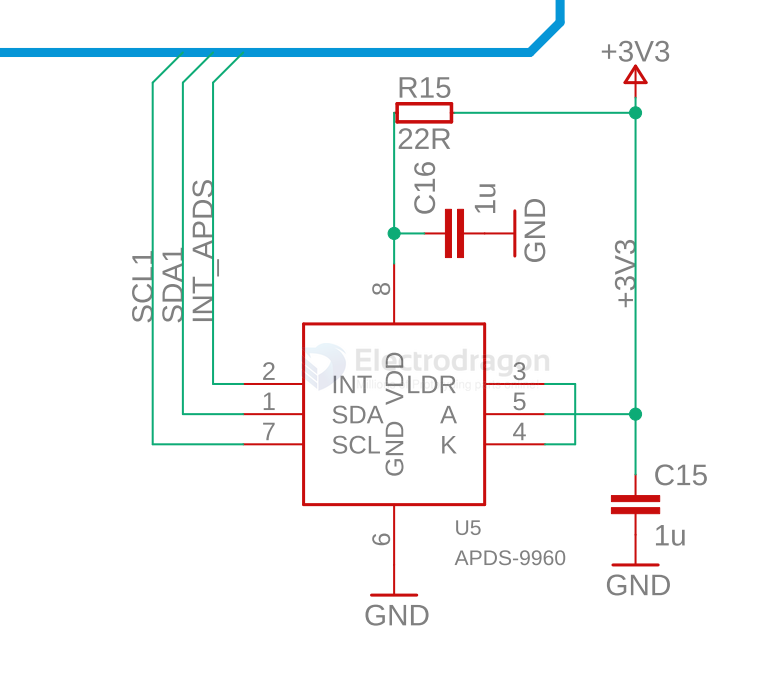
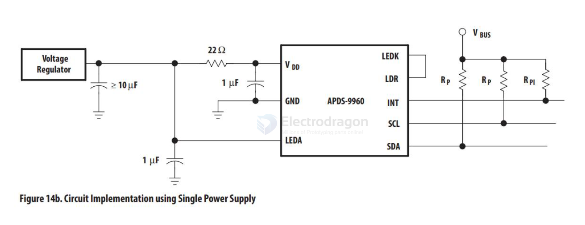

# apds-9960-dat

- [[SSL1045-dat]] - [[SSL1042-dat]] - [[APDS-9960-dat]] - [[APDS-9930-dat]] - [[sensor-gesture-dat]] - [[avago-dat]] 

## SCH 

## boards 

- [[SSL1045-dat]] - [[SSL1042-dat]] - [[APDS-9960-dat]] - [[APDS-9930-dat]]

## I/O Pins Configuration

| Pin | Name | Type   | Description                                                                       |
| --- | ---- | ------ | --------------------------------------------------------------------------------- |
| 1   | SDA  | I/O    | I2C serial data I/O terminal                                                      |
| 2   | INT  | Output | Interrupt - open drain (active low)                                               |
| 3   | LDR  | Input  | LED driver input for proximity IR LED, constant current source                    |
| 4   | LEDK | Output | LED driver LED Cathode, connect to LDR pin when using internal LED driver circuit |
| 5   | LEDA | Input  | LED Anode, connect to VLEDA on PCB                                                |
| 6   | GND  | Power  | Power supply ground. All voltages are referenced to GND                           |
| 7   | SCL  | Input  | I2C serial clock input terminal - clock signal for I2C serial data                |
| 8   | VDD  | Power  | Power supply voltage                                                              |

## APDS-9960

With this RGB and Gesture Sensor you will be able to control a computer, microcontroller, robot, and more with a simple swipe of your hand! This is, in fact, the same sensor that the Samsung Galaxy S5 uses and is probably one of the best gesture sensors on the market for the price.

The APDS-9960 is a serious little piece of hardware with built in UV and IR blocking filters, four separate diodes sensitive to different directions, and an I2C compatible interface. For your convenience we have broken out the following pins: VL (optional power to IR LED), GND (Ground), VCC (power to APDS-9960 sensor), SDA (I2C data), SCL (I2C clock), and INT (interrupt). Each APDS-9960 also has a detection range of 4 to 8 inches (10 to 20 cm).

## APDS-9930

The APDS-9930 provides an I2C interface-compatible ambient light sensor (ALS) and a proximity sensor with infrared LEDs in a single 8-pin package, where the ambient light sensor uses a dual photodiode to approximate 0.01 lux Performance of the human visual response to provide high sensitivity makes the device can operate in the dark glass.

The proximity sensor is fully calibrated for 100 mm object detection, eliminating factory calibration requirements for the terminal and secondary components. From the bright sunlight to the dark room, close to the detection function can work well.

The addition of a micro-optical lens to the module provides efficient transmission and reception of infrared energy, which reduces overall power consumption. In addition, the internal state machine allows the device to enter the low-power mode, bringing a very low average power consumption.

## ref 

- [[avago-dat]] 

