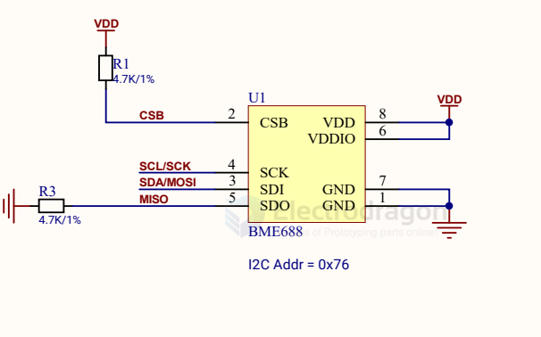

# bosch-dat

- [[6-axis-dat]] - [[BMI270-dat]]

- [[BME280-dat]] - [[BMP580-dat]] - [[BMP680-dat]] 

- [[BNO055-dat]]

Smart sensor combining accelerometer, gyroscope, magnetometer and orientation software

Integrated MCU + flash. Integrated sensor fusion.

https://www.bosch-sensortec.com/products/smart-sensor-systems/bno055/

BMI055 == 6-axis inertial sensor

The BMI055 is a very small, 6 axis inertial sensor, consisting of: A digital, triaxial 12bit acceleration sensor and a digital, triaxial 16bit, ±2000°/s gyroscope. The BMI055 allows very low-noise measurement of angular rates and accelerations in 3 perpendicular axes and thus senses tilt, motion, shock and vibration in mobile phones, handhelds, computer peripherals, man-machine interfaces, remote and game controllers.

## BME688 

The BME688 AI environmental sensor is a cutting-edge MEMS device that integrates temperature, humidity, barometric pressure, and VOC detection into a compact unit. With ±0.5°C temperature, ±3% humidity, and ±0.6 hPa pressure accuracy.

It supports I2C/SPI communication for real-time data collection and is compatible with Arduino, Raspberry Pi, ESP32/ESP8266, making it ideal for indoor air quality monitoring, smart home systems, industrial safety, and AI-driven environmental research.

- [[logic-level-shifter-dat]]

## BMM350 

- [[3-Axis-Magnetic-dat]]

BMM350 3-axis geomagnetic sensor is designed to measure magnetic fields across three vertical axes and functions as a compass. 

Utilizing Bosch's patented FlipCore technology, this sensor provides accurate spatial orientation without the need for calibration. 

It maintains compatibility with the previous BMM150 series while delivering enhanced performance, including lower power consumption and improved measurement capabilities. 

The BMM350 is powered by the groundbreaking TMR (tunnel magnetoresistance) technology, coupled with a distinctive field shock recovery feature that fortifies the device against interference from external magnetic fields, guaranteeing consistent high-precision measurements. 

Notably, the BMM350 introduces I3C communication, offering advanced data transmission capabilities that enhance sensor integration and reduce wiring complexity.

### Field Shock Recovery Function

Powered by TMR (Tunneling Magneto Resistive) technology, the BMM350 features Field Shock Recovery, ensuring stable performance even when exposed to external magnetic field disturbances. This function makes the sensor highly robust, providing reliable and consistent data in dynamic environments.

### Improved Sample Rate and I3C Communication

The BMM350 supports a high sample rate of up to 400Hz, delivering real-time data crucial for applications like AR/VR, AGV geomagnetic navigation, and drones. Additionally, its newly added I3C communication protocol enables faster data transmission and allows multiple sensors to be connected on a single bus, reducing wiring complexity and improving overall system efficiency.

### High Precision, Low Power Consumption, and Wide Measurement Range

The BMM350 offers a significant improvement in measurement accuracy compared to its predecessor, the BMM150. It operates with an ultra-low current of just 200μA in normal mode at a 100Hz sample rate, making it ideal for battery-powered devices. With a measurement range of ±2000μT across all three axes, it can handle a broad spectrum of magnetic fields, accommodating both high and low field strengths for various applications.

Comparison Table of BMM150 and BMM350

### SCH 

## ref 

- [[chip-dat]]