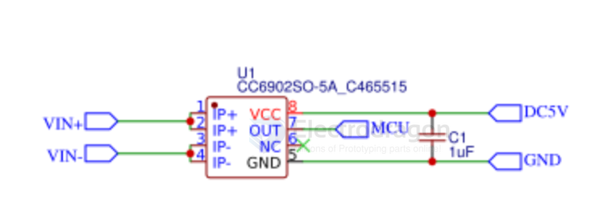
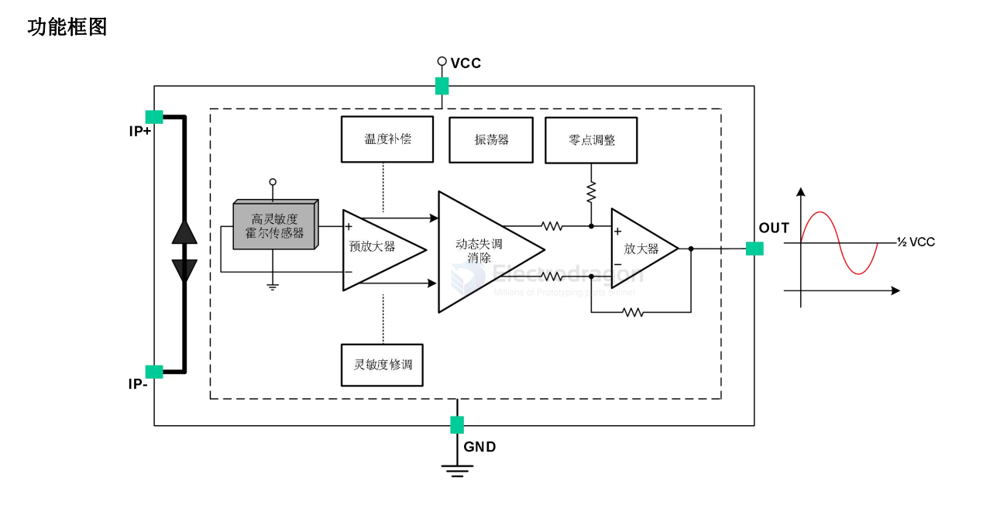

# CC6902-dat

- [[cross-chip-dat]] - [[CC6902-dat]] - [[ACS712-dat]]

CC6902 是一款高性能单端输出的线性电流传感器，可以更为有效的为交流（AC）或者直流（DC）电流检测方案，广泛应用于工业，消费
类及通信类设备。

CC6902 内部集成了一颗高精度，低噪声的线性霍尔电路和一根低阻抗的主电流导线。当采样电流流经主电流导线，其产生的磁场在霍尔
电路上感应出相应的电信号，经过信号处理电路输出电压信号，使得产品更易于使用。线性霍尔电路采用先进的 BiCMOS 制程生产，包含了
高灵敏度霍尔传感器，霍尔信号预放大器，高精度的霍尔温度补偿单元，振荡器，动态失调消除电路和放大器输出模块。在无磁场的情况下，
静态输出为 50%VCC。

在电源电压 5V 条件下，OUT 可以在 0.2~4.8V 之间随磁场线性变化，线性度可达 0.4%。CC6902 内部集成的动态失调消除电路使 IC 的灵
敏度不受外界压力和 IC 封装应力的影响。

## APP SCH 

## SCH 

## ref 

