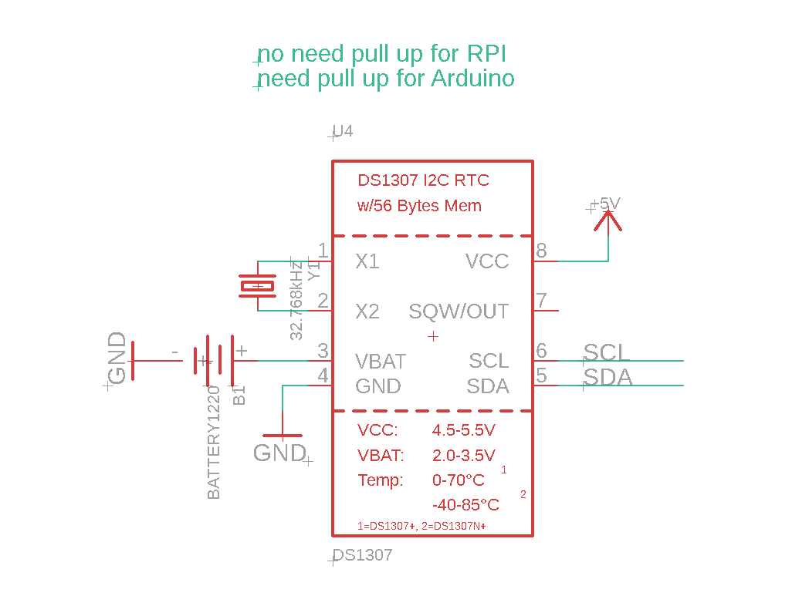
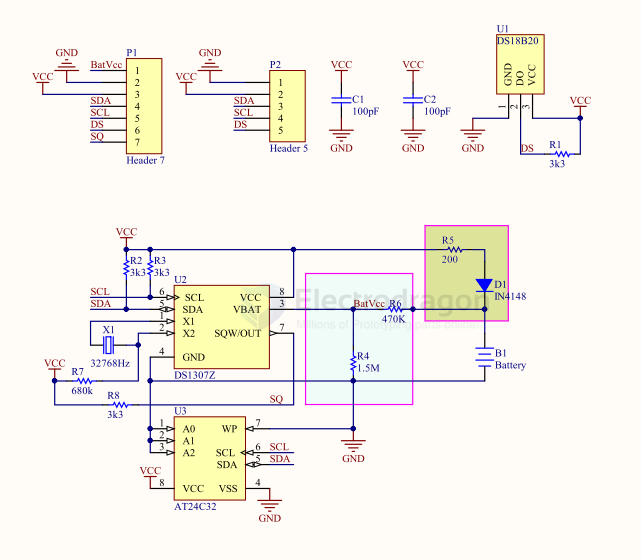

# ds1307-dat 

- [[MOT1007-dat]]

- [[RTC-dat]]

## SCH 

## ref

- [[RPI-dat]]

ref demo code 
- https://microdigisoft.com/interfacing-rtc-ds1307-module-with-raspberry-pi-using-python/
- https://pypi.org/project/adafruit-circuitpython-ds1307/

