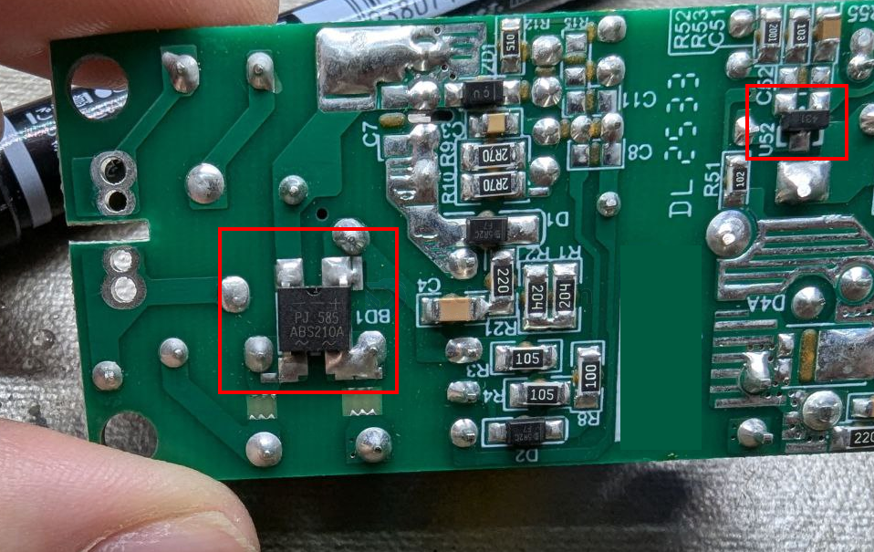
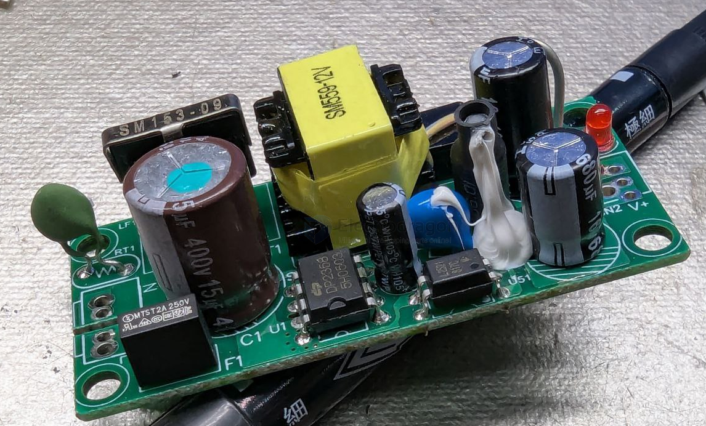
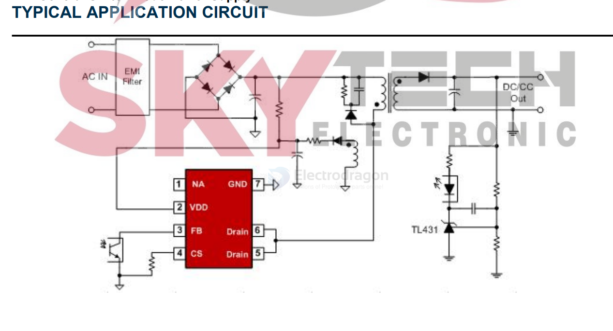

# depuw-dat

- [[OPM1068-dat]]

## DP2358

- datasheet == [[1451_DP2358-electrodragon.pdf]]

## Pin Description

- **Pin 1 (NA):** Un-connection Pin. Left float in the practical design
- **Pin 2 (VDD):** PIC power supply pin
- **Pin 3 (FB):** Feedback pin. The loop regulation is achieved by connecting a photo-coupler to this pin. PWM duty cycle is determined by this pin voltage and the current sense signal at Pin 4
- **Pin 4 (CS):** Current Sense Input Pin
- **Pin 5, 6 (Drain):** The Power MOSFET Drain
- **Pin 7, 8 (GNDP):** The Ground of the IC

## ref 

- [[ACDC-dat]]