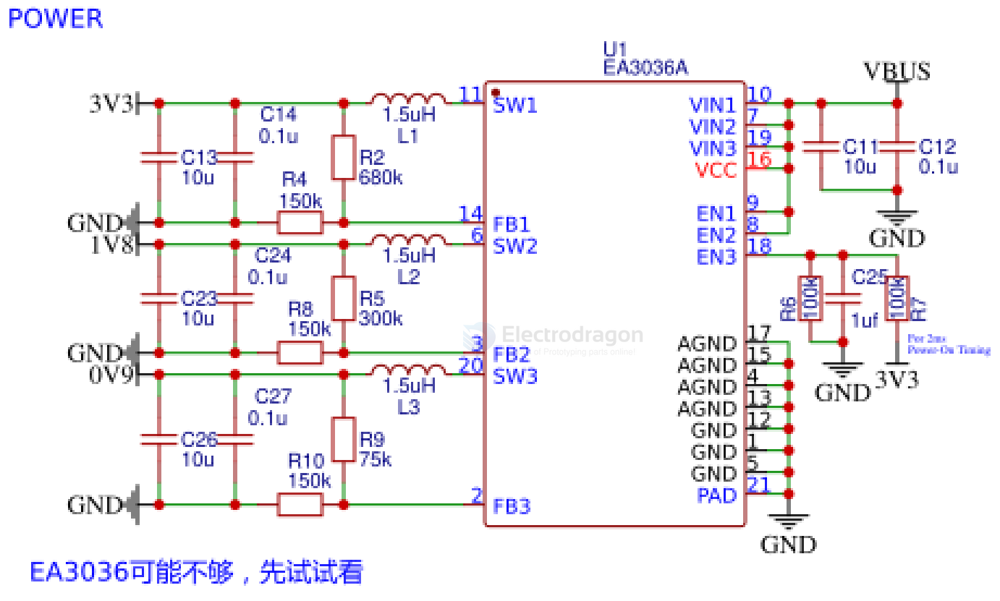

# EA3036-dat.md

The EA3036C is a 3CH power management IC for applications powered by one Li-Ion battery or a DC 5V adapter. It integrates three synchronous buck converters and can provide high efficiency output at light load and heavy load operation. The internal compensation architecture simplifies the application circuit design. Besides, the independent enable control makes the designer have the greatest flexibility to optimize timing for power sequencing purposes. The EA3036C is available in a 20 pin QFN 3x3 package.

- datasheet == [[EA3036C-datasheet.pdf]]

## SCH 

- IND-SMD_L2.0-W1.6
- 75K
- 300K
- 680K
- 10UF 0603

## SCH 2 

## ref 

- [[chip-dat]]