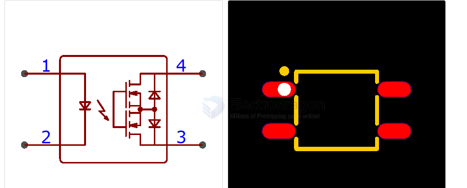

# ELM4xx-dat

- [[everlight-dat]] - [[ELM4xx-dat]] - [[relay-SSR-dat]]

4PIN MINI FLAT PACKAGE SOLID STATE RELAY ELM4XXA(BMS) SERIES 

Features
- Compliance Halogen Free(Br < 900ppm, Cl < 900ppm, Br+Cl < 1500ppm)
- Normally open signal pole signal throw relay
- Small 4pin SOP package in the 400V & 600V load voltage series
- Lower operation current
- Low-level off state leakage current
- Low on resistance
- Compliance with EU REACH
- Pb free and RoHS compliant
- UL and cUL (approved)
- VDE (approved)
- SEMKO (approved)
- NEMKO (approved)
- FIMKO (approved)
- CQC (approved)
- Qualified to AEC-Q101 test guidelines

Description

The ELM4XXA(BMS) is solid state relays containing an AlGaAs infrared LEDs on the light emitting side (input side)
optically coupled to a high voltage output detector circuit. The detector consists of a photovoltaic diode array and
MOSFETs on the output side. The single channel configuration is equivalent to 1 form A EMR. The devices in a 4-pin
small outline SMD package 

- datasheet == [[ELM4xx-DS.pdf]]

## ref 

