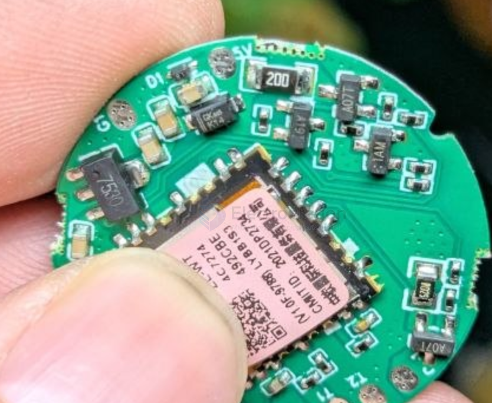

# holtek-dat

- [[serial-dat]] - [[holtek-dat]] - [[HT42B534-dat]]

- [[HT1621-dat]]

## LDO 

- HT7530 = HT36 = DS [[Holtek-Semicon-HT7530-2_C259499.pdf]]

- [[LDO-dat]] - [[HT7530-dat]] - [[holtek-dat]]

HT7530-1 

HT75XX-1 - 100mA Low Power LDO

HT7530-1 3.0V

- HT7533
- HT7536 
- HT7544
- HT7550 

