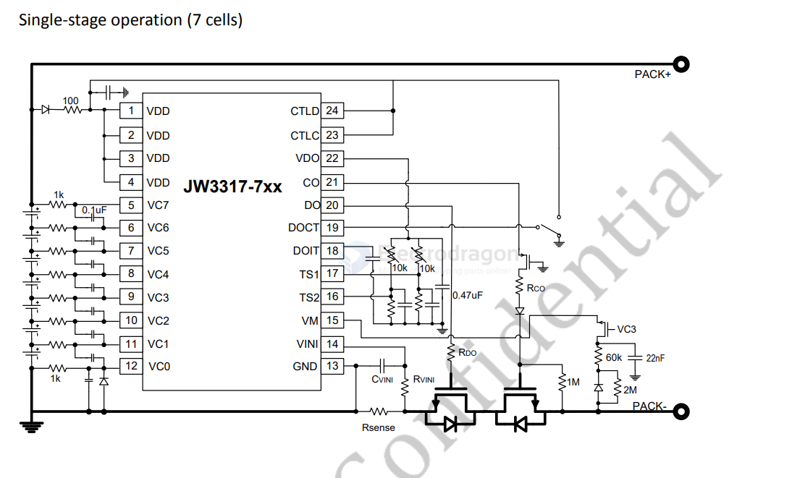
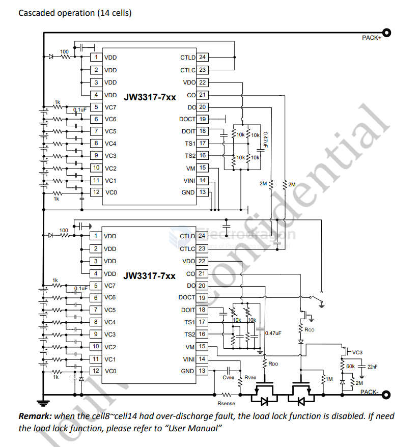
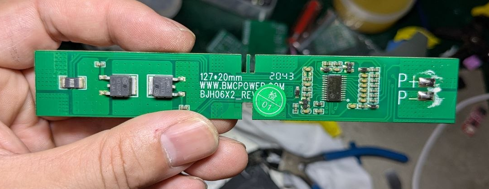
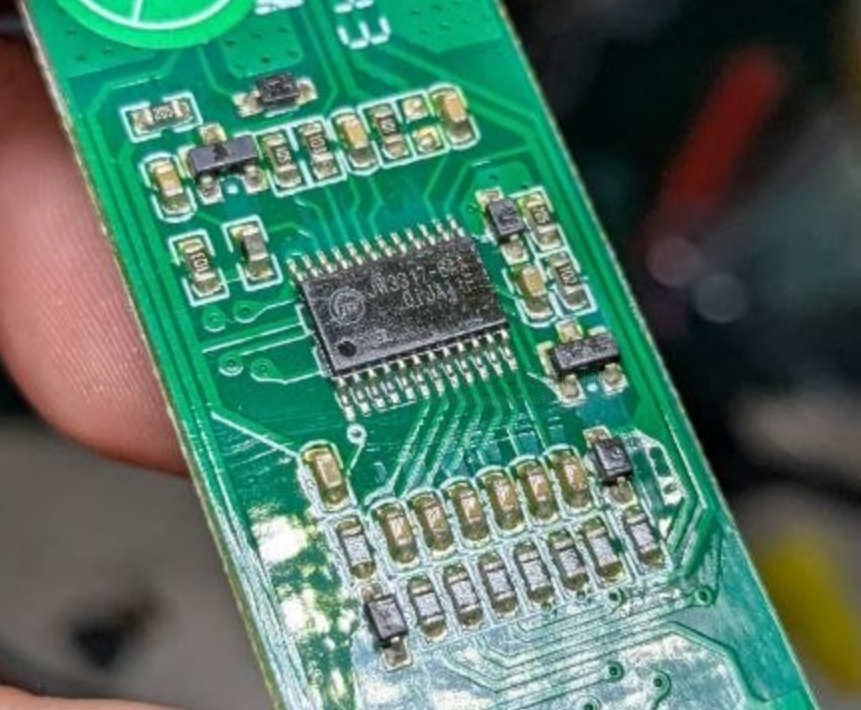

# JW3317-dat

JW3317 Series == 5/6/7 Cell Battery Protectors

JW®3317 is a multi-cell battery protection IC that includes high-accuracy voltage detection circuits and delay circuits. It is possible for users to monitor the status of 5~7 series cell lithium-ion rechargeable battery pack.

JW3317 provides multiple protect functions including over-charge, over-discharge, over-current, over-temperature and open wire detection. More JW3317s can operate in cascade to protect long string battery.

## SCH 

## board 

- [[NCE6020-dat]]