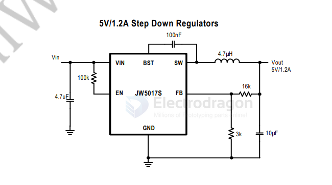

# JW5017-dat

JWBVJ SOT23-6 - [[JW5017-dat]] - [[joulwatt-dat]]

- [[dcdc-down-dat]] - [[JW5017-dat]] - [[joulwatt-dat]]

The silk-screen code JWBVJ on an SOT23-6 package represents the JW5017S, a synchronous step-down (buck) DC-DC converter chip manufactured by Joysemi (JW).

The JW® 5017S is a current mode monolithic buck switching regulator. Operating with an input range of 4.5V~26V, the JW5017S delivers 1.2A of continuous output current with two integrated N-Channel MOSFETs. 

## app 

- [[caddx-ant-dat]] - [[JW5017-dat]] - [[joulwatt-dat]]

FEATURES
- 4.5 V to 26 V operating input range 1.2A output current
- Up to 94% efficiency
- High efficiency (>78%) at light load
- Internal Soft-Start
- Fixed 1.2MHz Switching frequency
- Available in SOT23-6 package
- Input under voltage lockout
- Start-up current run-away protection
- Over current protection and Hiccup
- Thermal protection

## SCH 

## ref 