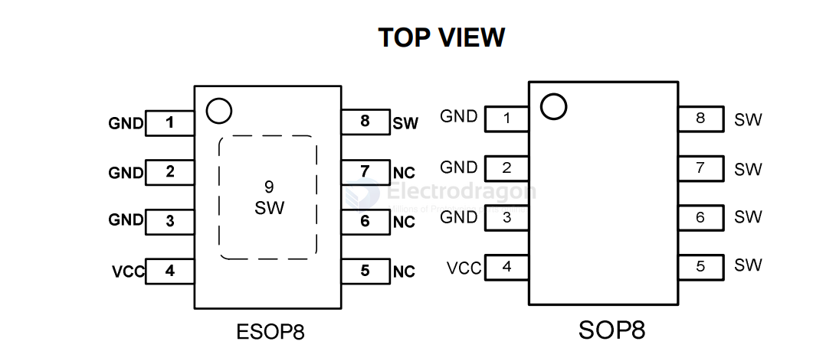
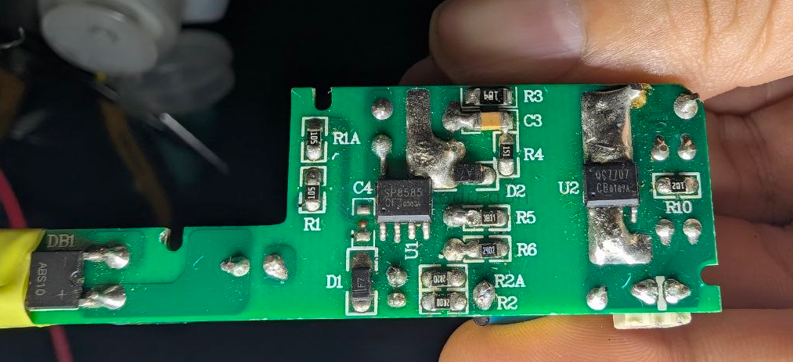
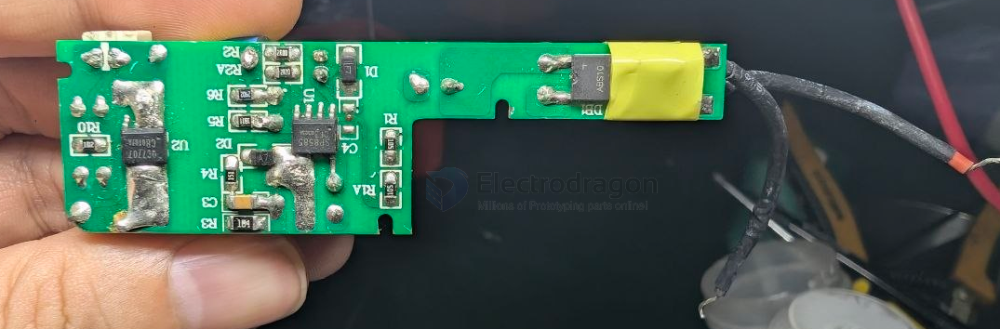
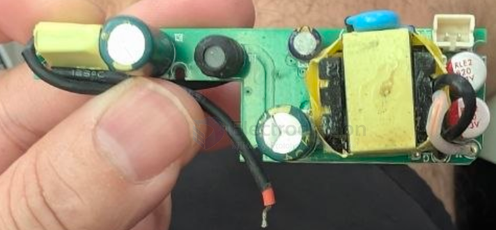

# JW7707-dat

- [[JW7707-dat]] - [[ACDC-dat]] - [[joulwatt-dat]] - [[QC7707-dat]]

- [[silan-dat]] - [[SP8585-dat]]

JW®7707C is a synchronous rectifier for Flyback converters. It integrates a 60V power MOSFET that can replace Schottky diode for high efficiency. It turns on the internal MOSFET if the VSW<-500mV and turns it off before the current from GND to SW is lower than zero. 

60V, 13mΩ Synchronous Rectifier

## QC7707 

QC7707 withstand Synchronous Rectifier Chip IC Charger Chip Alternative Schottky Diodes.

QC7707 is a synchronous rectifier diode integrated with 40V MOSFET. It is used to replace the rectifier diode of flyback converter.

## ref 

