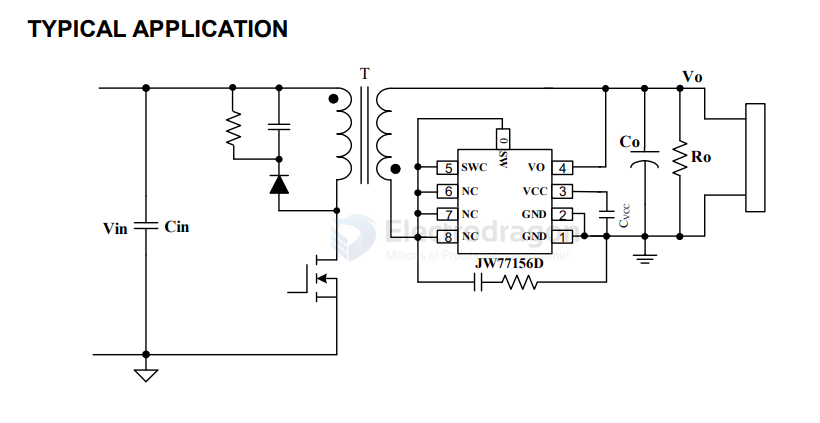

# JW77156-dat

- [[power-bank-dat]] - [[acdc-dat]]

`JW77156D` == 60V, 13mΩ Synchronous Rectifier

JW77156D is a synchronous rectifier, used for the secondary side rectification of Flyback. By driving an internal MOSFET, JW77156D is able to significantly improve the efficiency comparing with the conventional Diode rectifier.

When JW77156D senses VDS of internal MOSFET less than -300mV, it turns on the internal MOSFET. Once the VSW is greater than -10mV, JW77156D turns off the internal MOSFET. JW77156D supports multiple operation modes, such as DCM, CrCM, CCM and Quasi-Resonant.

By implementing the Joulwatt proprietary technology, JW77156D is able to handle CCM operation.

JW77156D is available in ESOP-8 package.

FEATURES
 Supports DCM, Quasi-Resonant, CrCM and CCM operation
 Support the Flyback topology
 Output voltage directly supply VCC
 Low quiescent current
 Under-voltage protection
 Fast driver capability for CCM operation
 ESOP-8 package

APPLICATIONS
 Flyback converter
 18W/20W quick charge adaptor

## ref 