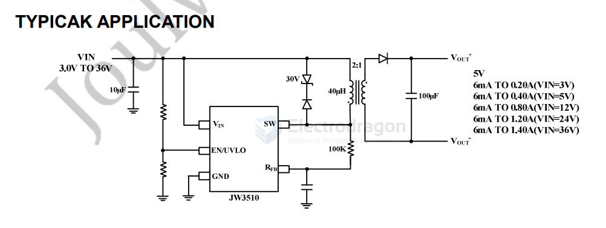
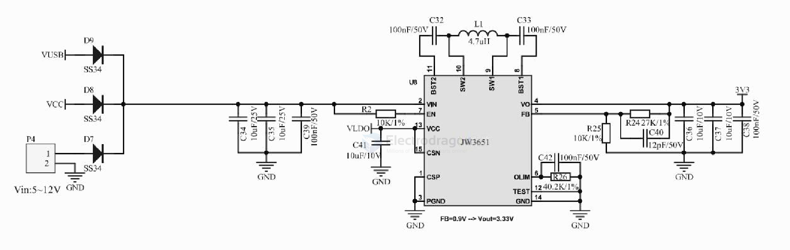
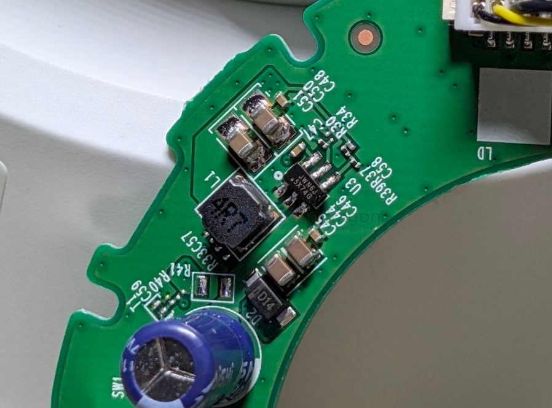

# joulwatt-dat

- [[joulwatt-dat]] - [[JW3510-dat]] - [[JW3651-dat]] - [[JW5359-dat]] - [[dcdc-down-dat]]

## JW3510 

- [[JW3510-dat]] - [[ACDC-dat]] 

JW3510 - 42VIN Micropower No-Opto Isolated Flyback Converter with 65V/1.4A Switch

The JW® 3510 is a micropower isolated Flyback converter. By sampling the isolated output voltage directly from the primary-side flyback waveform, the part requires no third winding or opto-isolator for regulation. The output voltage can be programmed with a single external resistor. Besides, internal compensation and soft-start further reduce external component count.

The JW3510 operates with an input voltage range of 3.0V to 42V and can deliver up to 6W of isolated output power. The primary-side can deliver 1.4A peak current with an internal integrated 65V N-Channel DMOS power switch. The JW3510 is designed with boundary mode, discontinuous mode and burst mode operation at different load to improve load regulation and maintain high efficiency while minimizing the output voltage ripple. 

## JW3651 

JW3651 -- 21V 3A 4-Switch -- Buck-Boost Converter

JW5359/JW5359F

18V/2A

Sync. Step-Down Converter

## ref 

