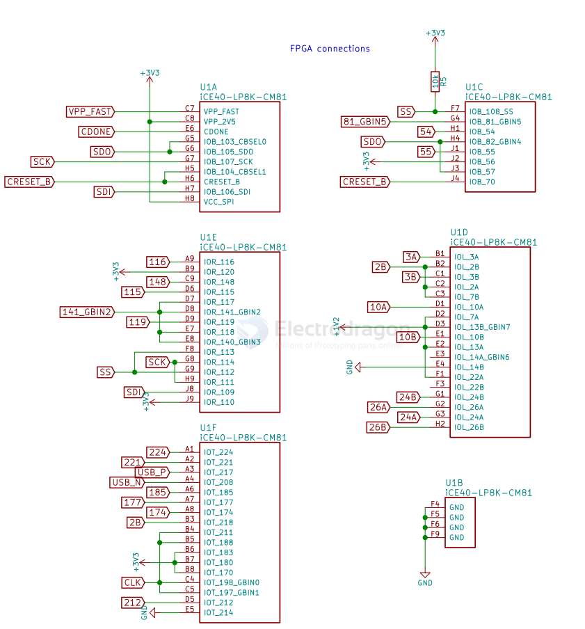

# lattice-dat

- [[LDO-2CH-dat]] - [[LDO-dat]]

FPGA: `Lattice iCE40UP5K FPGA`
Logic Resources: 5,280 LUTs (capable of hosting RISC-V soft-core CPUs)
Embedded Memory: 120 Kbit Block RAM
SPRAM: 1 Mbit (128 KB) Single-Port SPRAM
Clocking: On-chip PLL
Hard IP: 2 × SPI, 2 × I2C
Internal Oscillators: 10 kHz and 48 MHz
DSP Resources: 8 × DSP multiplier blocks

## ICE40 

## ref 

