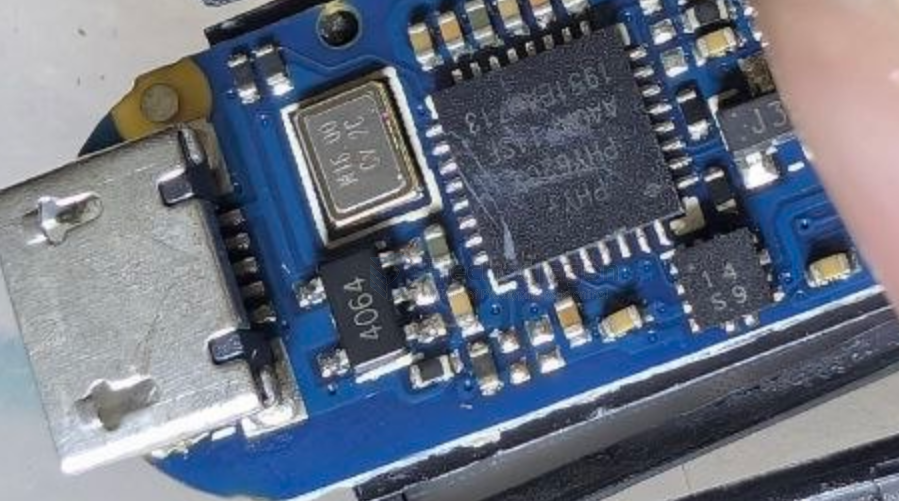
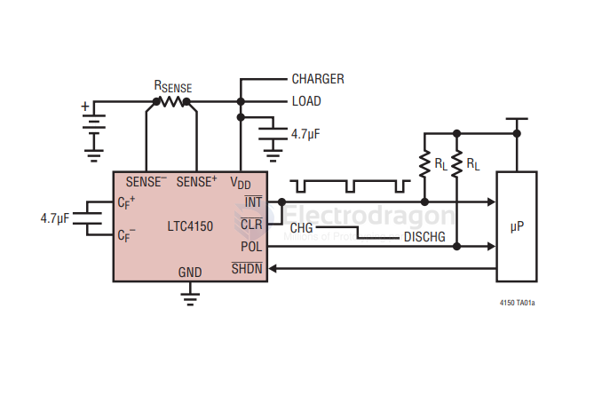

# linear-technology-dat

- [[battery-charger-dat]] - [[LTC4064-dat]] 

## filter 

LTC1060 - Universal Dual Filter Building Block

The LTC® 1060 consists of two high performance, switched capacitor filters. 

Each filter, together with 2 to 5 resistors, can produce various 2nd order filter functions such as lowpass, bandpass, highpass notch and allpass. 

The center frequency of these functions can be tuned by an external clock or by an external clock and resistor ratio. Up to 4th order full biquadratic functions can be achieved by cascading the two filter blocks. 

Any of the classical filter configurations (like Butterworth, Chebyshev, Bessel, Cauer) can be formed.

## bandgap reference

LT1460 - Micropower Precision Series Reference Family

The LT®1460 is a micropower bandgap reference that combines very high accuracy and low drift with low power dissipation and small package size. 

## Power 

LT1963A Series - 1.5A, Low Noise, Fast Transient Response LDO Regulators

LT3029 - Dual 500mA/500mA Low Dropout, Low Noise, Micropower Linear Regulator

## Coulomb Counter

Coulomb Counter/Battery Gas Gauge - [[LTC4150-dat]] 

[[Coulomb-Counter-dat]] - [[battery-charger-dat]] - Coulomb Counter/Battery Gas Gauge - [[LTC4150-dat]] - [[linear-technology-dat]]

The LTC®4150 measures battery depletion and charging in handheld PC and portable product applications. The device monitors current through an external sense resistor between the battery’s positive terminal and the battery’s load or charger. A voltage-to-frequency converter transforms the current sense voltage into a series of output pulses at the interrupt pin. These pulses correspond to a fi xed quantity of charge fl owing into or out of the battery. The part also indicates charge polarity as the battery is depleted or charged.

The LTC4150 is intended for 1-cell or 2-cell Li-Ion and 3-cell to 6-cell NiCd or NiMH applications.

## ref 

- [[chip-dat]]