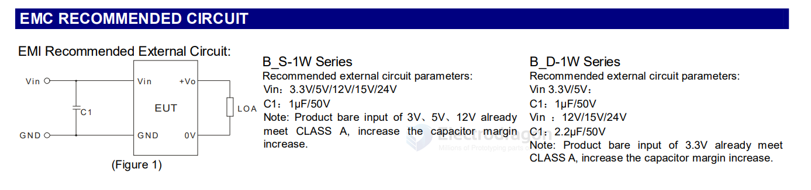
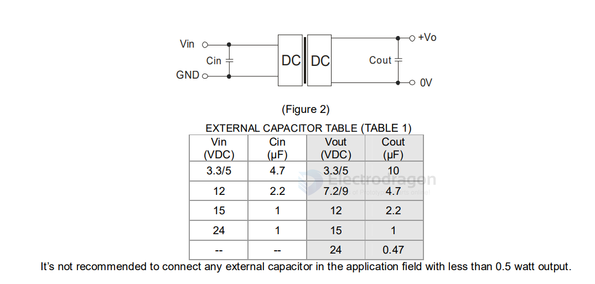
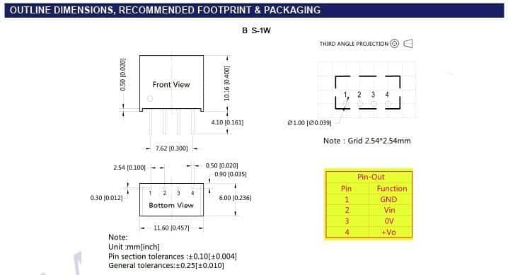

# B-S-1W-dat

- MORNSUN - B0505S-1W
- MORNSUN - B0505S-1WR2
- MORNSUN - B0505S-1WR3

datasheet
- [[B0505S-1WR2.pdf]] = 05V R2, 1500VDC Isolation, 82% Efficiency 
- [[B0515S-1W.pdf]] = 15V, 1000VDC Isolation, 80% Efficiency 

## FEATURES: 

- Efficiency up to 80%
- Miniature SIP/DIP Package
- 1KVDC Isolation
- Operating Temperature Range: -40°C ~ +85°C
- Low Temperature Rise
- No External Component Required
- PCB Mounting
- Industry Standard Pinout 

## EMC RECOMMENDED CIRCUIT

## Recommended circuit

## Dimension 

**Input & Output**: As clearly indicated in the datasheet, you can use the module well if you have a >300mA input dc supply in 4.5-5.5V range but the maximum output load current never exceeds the 200mA at 5VDC limit.

**Inside Circuitry**: Although I didn’t get a worthy chance to break apart the B0505S-1W module, it came to my notice that its inside electronics is mainly based on the “Royer Oscillator” (https://en.wikipedia.org/wiki/Royer_oscillator) circuit. 

As far as I know, the traditional Royer oscillator circuit only provides basic functions but once the circuit is abnormal, the  module may be damaged and even cause serious consequences. **At present, the module is available without a continuous short circuit protection (SCP) feature!**

[read more on this post. - MORNSUN® B0505S-1W Review](https://www.codrey.com/electronic-circuits/mornsun-b0505s-1w-review/)

