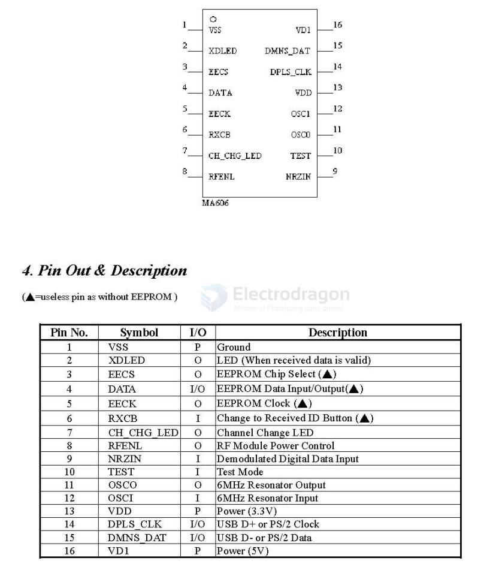

# MA6162-dat

- [[mosart-dat]] - [[MA6162-dat]]

- [[MC3361-dat]]

1. General Description

MA6162 USB-PS/2 Wireless Mouse Receiver IC

MA6162 is a wireless mouse receiver control IC. It operates using RF at a frequency of 27
MHZ, single channel. 

MA60H09, MA6121, MA6231 and MA6221 can be the transmitter.

MA6162 (packaged with SOP-16, 150mil) can be configured as USB or PS/2 mode. It's
auto-detected. It can receive command and echo status or data format which are compatible with
PS/2 mode or USB mode.

1. Features

- USB-PS/2 Auto-Detection Circuit.
- 5V -> 3.3V Regulator.
- 120KHz Ring Oscillator.
- Compatible with PS/2 protocol.
- Conforms to USB 1.5 Mbps Specification, Version 1.1.
- Supports 1 device address and 2 endpoints (1 control endpoint and 1 interrupt endpoint).
- Integrated USB transceiver.
- Built-in 1.5Kohm D- pull-high resistor.
- 6MHz clock rate (76.8KHz clock rate in PS/2 and air interface).
- Compatible with Microsoft scrolling and 5B mouse.
- Build-in error detection circuit (one way).
- Baud Rate: 4800 bps in air or 4096 bps as in optical mouse mode.

