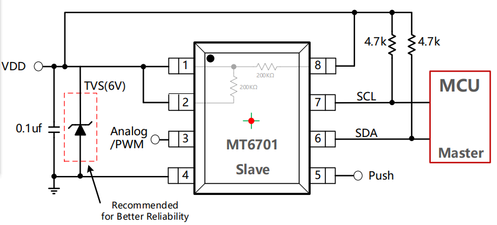

# MT6701-dat

CN datasheet == [[MT6701_Rev.1.7_中文版.pdf]]

## ref SCH 

## docs 

- [[MT6701_CRC_使能例程.c]]
- [[MT6701磁编模块修改说明.docx]]
- [[MT6701驱动软件.zip]]
- [[MT6816CT_3Wire_4WiresMCU__SPI.ioc]]
- [[MT6701_With_Push_Drive.zip]]

## ref 

- [[novosense-dat]]