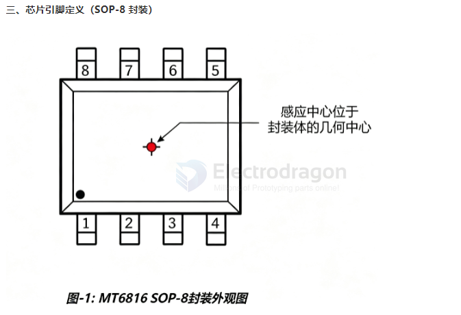
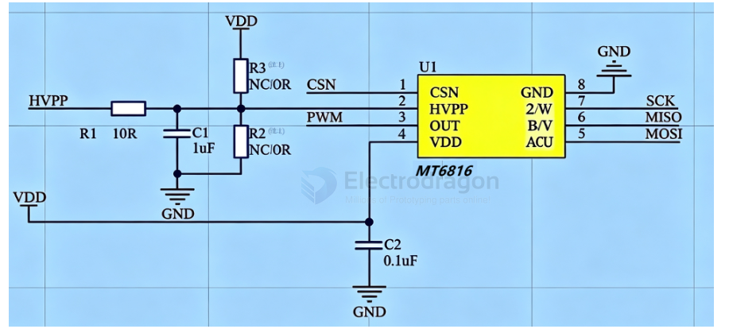

# MT6816-dat

- [[MT6816-dat]] - [[novosense-dat]] - [[sensor-hall-dat]] - [[encoder-dat]]

## MT6816：14-bit Magnetic Angle Encoder

The MT6816 is MagnTek's third-generation magnetic angle encoder chip, which is based on anisotropic magnetoresistive (AMR) technology and proprietary signal processing technology to achieve absolute angle measurement of 0~360°. 

The chip consists of a pair of AMR Wheatstone bridges and signal processing ASIC circuits. 

As the magnetic field parallel to the surface of the chip rotates, the chip outputs a corresponding encoded angle signal with a signal delay of less than 2us, and the user can also read the angle data calculated inside the chip through the high-speed SPI interface.

Compared with traditional Hall sensors, AMR angle sensors are easier for customers to install because they operate in the saturation zone, which reduces the magnetic field requirements. The MT6816 is available in a SOP-8 package, which is widely used in various consumer and industrial fields such as position feedback control and rotation control of various motors.

- [[hall-sensor-dat]] - [[angle-encoder-dat]]

- stm32 cube file == [[MT6816CT_3Wire_4WiresMCU__SPI.ioc]]

一、产品概述

MT6816 是麦歌恩微电子推出的AMR 各向异性磁阻技术高速高精度磁编码器芯片，用于 0~360° 绝对角度位置检测，可替代传统光电编码器、霍尔传感器，适配各类电机闭环控制场景。

二、核心基础优势

磁场感应特性：仅响应平行芯片表面的磁场方向变化，对磁铁加工误差、芯片与磁铁安装距离误差容忍度高，装配容错性强；

宽温工作区间：-40℃~125℃，通过 AECQ-100 车规认证，工业、车载场景均可使用；

高速检测能力：支持最高 25000RPM 转速，角度输出系统延时＜2μs，实时性优异。

宽电压供电:3.3V-5V

两路输出：

SPI 总线输出：14 位高精度绝对角度

单线 PWM 输出：12 位绝对角度数据

增量信号输出（可编程）

输出信号	参数规格
- ABZ 增量脉冲	1~1024 脉冲 / 圈，任意整数分辨率用户可编程，最高等效 4096 步 / 圈
- UVW 霍尔模拟信号	支持 1~16 对极任意整数对极配置，直接替代硬件霍尔元件

- [[signal-ABZ-dat]] - [[signal-UVW-dat]]

## pins 

引脚号	引脚名称	类型	功能描述
- 1	CSN	数字输入	SPI 片选使能控制脚
- 2	HVPP	电源	MTP 编程高压输入；同时作为模式配置引脚
- 3	OUT	数字输出	PWM 绝对角度单线输出
- 4	VDD	电源	3.3~5V 芯片主供电
- 5	A/U	双向 IO	ABZ 的 A 相 / UVW 的 U 相；4 线 SPI MOSI / 3 线 SPI SDAT
- 6	B/V	双向 IO	ABZ 的 B 相 / UVW 的 V 相；4 线 SPI MISO
- 7	Z/W	双向 IO	ABZ 的 Z 零脉冲 / UVW 的 W 相；SPI 时钟 SCK
- 8	GND	地	芯片公共参考地

### SCH 

SCH 2 

## ref 