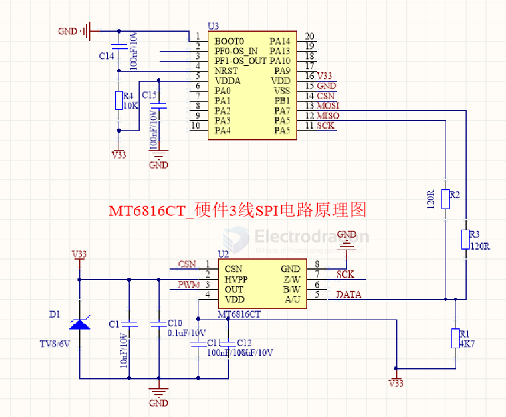

# novosense-dat

- [[MT6701-dat]]

## MT6816：14-bit Magnetic Angle Encoder

The MT6816 is MagnTek's third-generation magnetic angle encoder chip, which is based on anisotropic magnetoresistive (AMR) technology and proprietary signal processing technology to achieve absolute angle measurement of 0~360°. 

The chip consists of a pair of AMR Wheatstone bridges and signal processing ASIC circuits. 

As the magnetic field parallel to the surface of the chip rotates, the chip outputs a corresponding encoded angle signal with a signal delay of less than 2us, and the user can also read the angle data calculated inside the chip through the high-speed SPI interface.

Compared with traditional Hall sensors, AMR angle sensors are easier for customers to install because they operate in the saturation zone, which reduces the magnetic field requirements. The MT6816 is available in a SOP-8 package, which is widely used in various consumer and industrial fields such as position feedback control and rotation control of various motors.

- [[hall-sensor-dat]] - [[angle-encoder-dat]]

- stm32 cube file == [[MT6816CT_3Wire_4WiresMCU__SPI.ioc]]

### SCH 

## ref 

- [[chip-dat]]