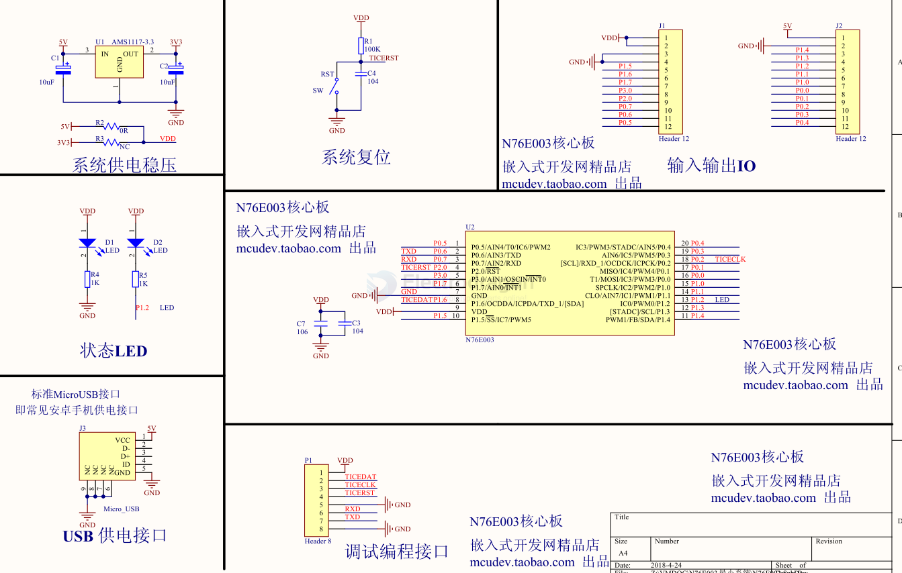
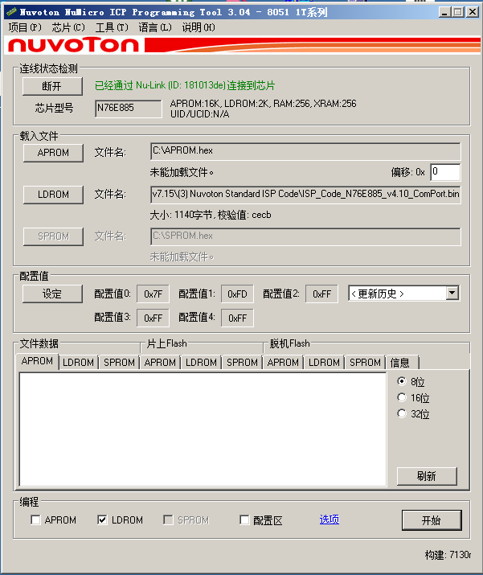
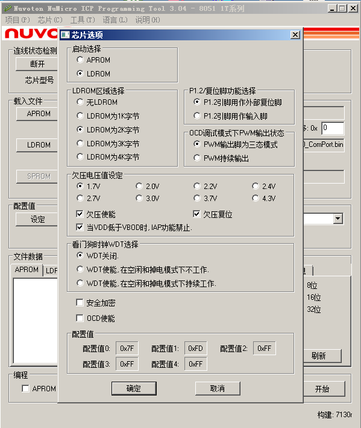
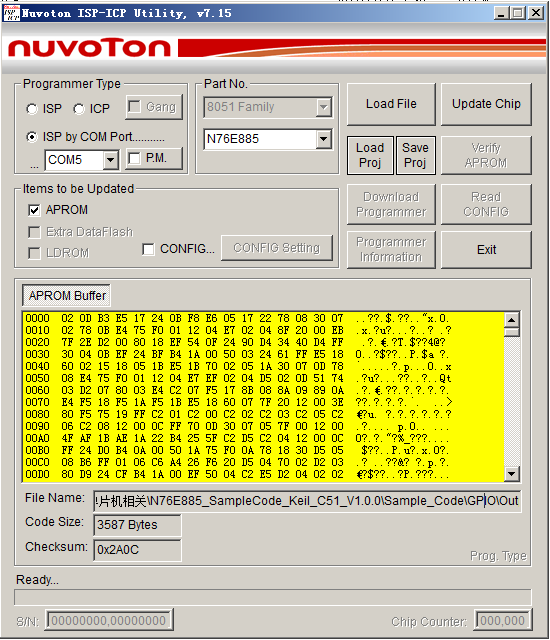
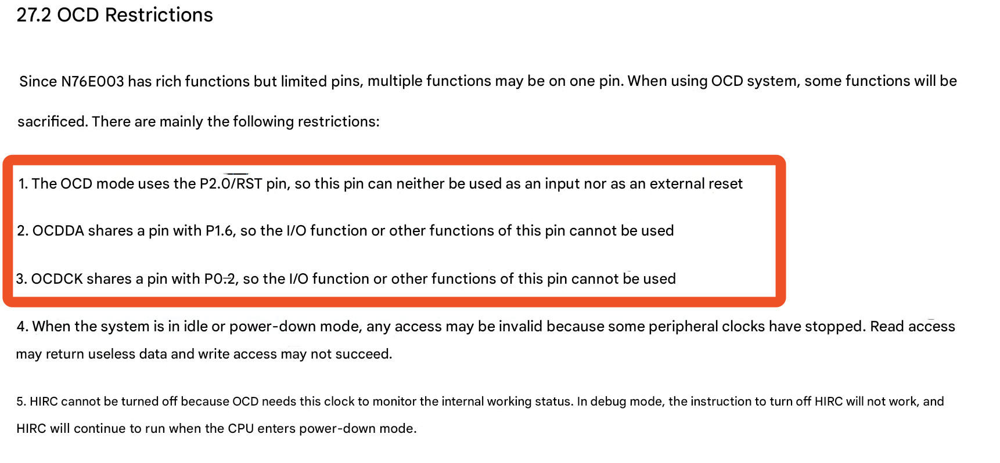

# n76e003-dat

SDK == [[keil-dat]] + [[IAR-dat]] + [[MDK-ARM-dat]]

## Features 

* 1T / 8051: 1T Value Microcontroller, 8051 We are more familiar with the classic kernel;
* 18KB Flash ROM: better than 8KB Flash, and 18KB of flash space, all can be used as data storage space;
* Same 1024B SRAM
* 17 + 1 inputs: better than up to 16 GPIOs;
* 2xUART, I2C, SPI: Better than SPI / I2C / UART (one more UART);
* 8ch of 12bit ADC: better than 5ch 10bit ADC;
* 6ch of individual duty PWM: better than 3 PWM outputs;
* 10KHz LIRC for WDT reset / WKT;
* 16MHz HIRC ± 1% Room temp. ± 2% full condition;
* -40 to 105 ℃ wider temperature range;
* 2.4V to 5.5V wider supply voltage range;
* TSSOP20 / QFN20;
* ESD & EFT: HBM / 8KV MM / 400V, Over 4KV, excellent ESD and EFT, immunity to interference and ESD protection;

## APP 

wireless power transmitter 

## SCH 

### Boards 

[[SCU1048-dat]] - [[SCU1050-dat]] - [[DOD1077-dat]]

## FAQ 

**Q: Can I use serial port download like with STC microcontrollers?**

A: Not all Nuvoton microcontrollers support ISP serial port download. Only models with LDROM might be able to download programs via the serial port.

**Q: Which models support serial port download?**

A:

Standard 8051 Series

Models that come with ISP program from the factory:

        W78E052D, W78E054D, W78E058D, W78E516D
        N78E055A, N78E059A, N78E517A, N78E366A

And models that do not come with ISP program from the factory:

        W77E516A, W77E352, W79E(L)632, W79E(L)633
        W79E(L)658, W79E(L)659

Low Pin Count 8051 Series

Models that come with ISP program from the factory:

        N79E715

And models that do not come with ISP program from the factory:

        N76E616, N76E885, N79E81x, N79E84x, N79E85x
        N76E003 (Added by blogger)

**Q: How to use the ICP tool to burn the ISP program into LDROM?**

A: The official website provides ISP .bin files for various microcontroller models. The file location is as follows, where XXXX is the microcontroller model:
`...\Nuvoton_8051_ISP-ICP_Programmer_v7.15\(3) Nuvoton Standard ISP Code\ISP_Code_XXXX_...bin`
Open NuMicro ICP Programming Tool.

Connect Nu-Link and click Continue. Click the LDROM button to select the .bin file for ISP. Make sure to select the correct model.

Continue by clicking the setting button in the configuration values to open settings. Select "Specify LDROM" for startup, and choose an appropriate size for the LDROM area. Select a size sufficient for the .bin file mentioned above; do not make it too large, as a larger LDROM size reduces the available space in the APP area.

Leave other settings unchanged. Click OK to close the configuration window and return to the main window. In the programming section at the bottom, select LDROM and Config. APROM does not need to be selected. Click Start to burn the ISP program into LDROM and set it to boot from LDROM. This means that upon power-on, the ISP service program runs first. If a download signal is detected on the serial port, it proceeds with the download; otherwise, it jumps to the user program (APROM).

**Q: The ISP program has been burned into LDROM. How to perform ISP serial port download?**

A: Use the official ISP burning software, ISP-ICP Utility.

Note that N76E003 is not supported by this software (it cannot be selected from the list). N76E003 requires another official ISP software: Nuvoton NuMicro ISP Programming tool for burning.

**Q: When using ISP software for burning, does it support both HEX and BIN files, like STC's ISP software?**

A: It only supports BIN files. Therefore, HEX files generated by Keil need to be converted to BIN files using a third-party program (HEX2BIN) before burning. Otherwise, the burning process itself will not report an error, but the program will not execute correctly.

**Q: Is the download procedure the same as for STC microcontrollers (i.e., click download in software, then power on the module, and the program starts automatically after download)?**

A: It's slightly different. The steps are: first, click the connect button, then power on or cold boot the microcontroller. The software will then show a successful connection. At this point, the microcontroller is in burning wait state (essentially running the program in LDROM, waiting in a loop for download commands). As long as power is not cut or the device is not restarted, you can download multiple times without needing another cold boot. After the download is complete, the microcontroller will not automatically restart, nor will it immediately execute the newly downloaded program. A manual cold boot is required to execute the new program.

**Q: Does N76E616 support ISP serial port download?**

A: Yes. But first, you need to write the ISP firmware into LDROM using ICP. Then, use ISP-ICP Utility 7.15, select "ISP by COM port", select APROM, click UPLOAD, and finally restart the target board.
There's a major pitfall here to be aware of!!!
N76E616 has two sets of serial ports. The official ISP program uses UART1 (P5.6 RX, P5.7 TX), not the default UART0 (P2.1 RX, P2.2 TX). The blogger was stuck on this for several days...

**Q: Why doesn't the `Timer3_Delay10us` function in the N76E003 official BSP delay correctly?**

A: In the `Timer3_Delay10us` function in the official `Delay.c`:
`T3CON = 0x07;` (128 prescaler)
Needs to be changed to:
`T3CON = 0x02;` (4 prescaler)
For the delay to be correct.
The reason is that the reload value after this uses a macro defined for a 4 prescaler, and the two need to match. This is a bug in the official BSP code.

**Q: Why does Keil always show "flash download failed" during debugging?**

A: The reason is unknown, but try changing the power-on boot target area from LDPRG to APPRG. This might solve the problem. Once successful, changing it back does not seem to affect it.

**Q: Why is the data incorrect during online simulation in Keil, but there are no issues when running in non-debug mode?**

A: When using the online simulation function of N76E003, the simulation interface occupies pins:
P02, P16, P20
So, these 3 pins should be avoided. Below is the official explanation.

## Resources 

[Software](https://www.nuvoton.com.cn/products/microcontrollers/8bit-8051-mcus/low-pin-count-8051-series/n76e003/?group=Software&tab=2)

- Board SupporThe Board Support Package (BSP) Keil for N76E003/ N76S003.
- Board SupporThe Board Support Package (BSP) IAR for N76E003/ N76S003.
- Example CodeTimer/GPIO_N76E003_Weigand
- NuTool SuiteNu-Link USB Driver

[Hardware](https://www.nuvoton.com.cn/products/microcontrollers/8bit-8051-mcus/low-pin-count-8051-series/n76e003/?group=Hardware&tab=2)

- Schematic, P(N76E003 Series Reference Designfor 5w wireless Charger
- Schematic, P(NuTiny-SDK-N76E003 Gerber & Schematic PCB File

[Document](https://www.nuvoton.com.cn/products/microcontrollers/8bit-8051-mcus/low-pin-count-8051-series/n76e003/?group=Document&tab=2) 

- Data SheetDS_N76E003_EN_ReV1.10
- ERRATAN76E003 Series Errata Sheet
- Migration GuiMG_8002_N76E003_To_MS51_16KBFlash_Series_Migration_Guide_SC_Rev1.00
- Schematic, P(N76E003 Series Reference Design for 5W Wireless Charger
- Schematic, P(NuTiny-SDK-N76E003 Gerber & Schematic PCB File
- User ManualNuTiny-SDK-N76E003 User Manual
- User ManualN76E003 Series Brushless DC Motor Control User Manual
- User ManualNu-Link Driver for Keil MDK Revision History
- User ManualNu-Link Driver for IAR EWARM Revision History
- User ManualNuTool-PinView Revision History
- User ManualNuMicro ICP Tool (In-Circuit Programming) User Manual
- User ManualNu-Link Command Tool User Manual
- User ManualNu-Link-Gang User Manual

## repo

- https://github.com/buttim/NuvoFlash
- https://github.com/steve-m/N76E003-playground
- https://github.com/frank-zago/nvtispflash

## demo code 

- [N76E003_BSP_Keil_C51_V0.04.zip](https://electrodragon.com/N76E003_BSP_Keil_C51_V0.04.zip)
- [N76E003_C51_V1.0.6.zip](https://electrodragon.com/N76E003_C51_V1.0.6.zip)
- [Nuvoton_8051_Keil_uVision_Driver_v2.00.6561.exe](https://electrodragon.com/Nuvoton_8051_Keil_uVision_Driver_v2.00.6561.exe)

## ref 

- [[DS_N76E003_EN_Rev1.10.pdf]]

- The Board Support Package (BSP) Keil for N76E003/ N76S003. - https://www.nuvoton.com/products/microcontrollers/8bit-8051-mcus/low-pin-count-8051-series/n76e003/?group=Software&tab=2

- [[nuvoton-dat]]

- [[MCU-dat]]

- [[MDK-ARM-dat]]