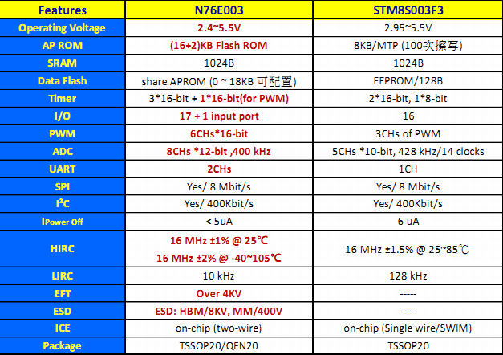
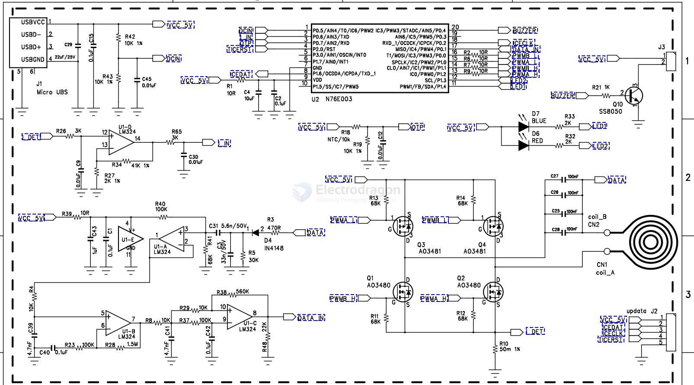

# n76e003-dat

## Features 

* 1T / 8051: 1T Value Microcontroller, 8051 We are more familiar with the classic kernel;
* 18KB Flash ROM: better than 8KB Flash, and 18KB of flash space, all can be used as data storage space;
* Same 1024B SRAM
* 17 + 1 inputs: better than up to 16 GPIOs;
* 2xUART, I2C, SPI: Better than SPI / I2C / UART (one more UART);
* 8ch of 12bit ADC: better than 5ch 10bit ADC;
* 6ch of individual duty PWM: better than 3 PWM outputs;
* 10KHz LIRC for WDT reset / WKT;
* 16MHz HIRC ± 1% Room temp. ± 2% full condition;
* -40 to 105 ℃ wider temperature range;
* 2.4V to 5.5V wider supply voltage range;
* TSSOP20 / QFN20;
* ESD & EFT: HBM / 8KV MM / 400V, Over 4KV, excellent ESD and EFT, immunity to interference and ESD protection;

## APP 

wireless power transmitter 

### Boards 

[[SCU1048-dat]] - [[SCU1050-dat]] - [[DOD1077-dat]]

## repo

- https://github.com/buttim/NuvoFlash
- https://github.com/steve-m/N76E003-playground
- https://github.com/frank-zago/nvtispflash

## ref 

- [[DS_N76E003_EN_Rev1.10.pdf]]

- The Board Support Package (BSP) Keil for N76E003/ N76S003. - https://www.nuvoton.com/products/microcontrollers/8bit-8051-mcus/low-pin-count-8051-series/n76e003/?group=Software&tab=2

- [[nuvoton-dat]]

- [[MCU-dat]]