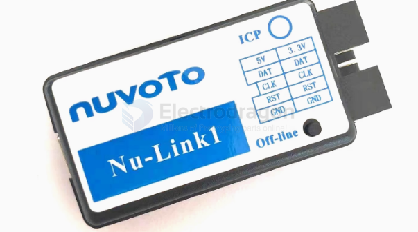
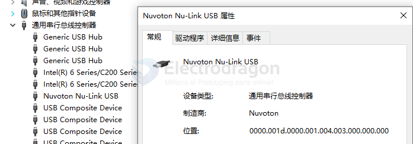
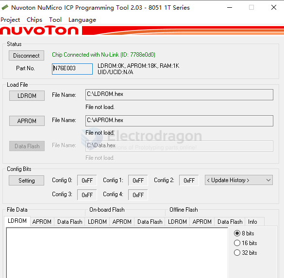
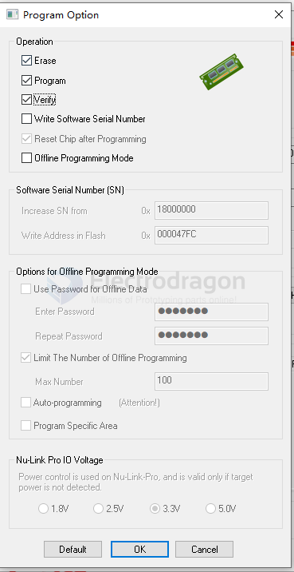
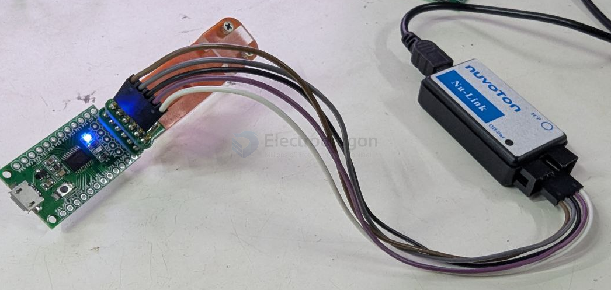
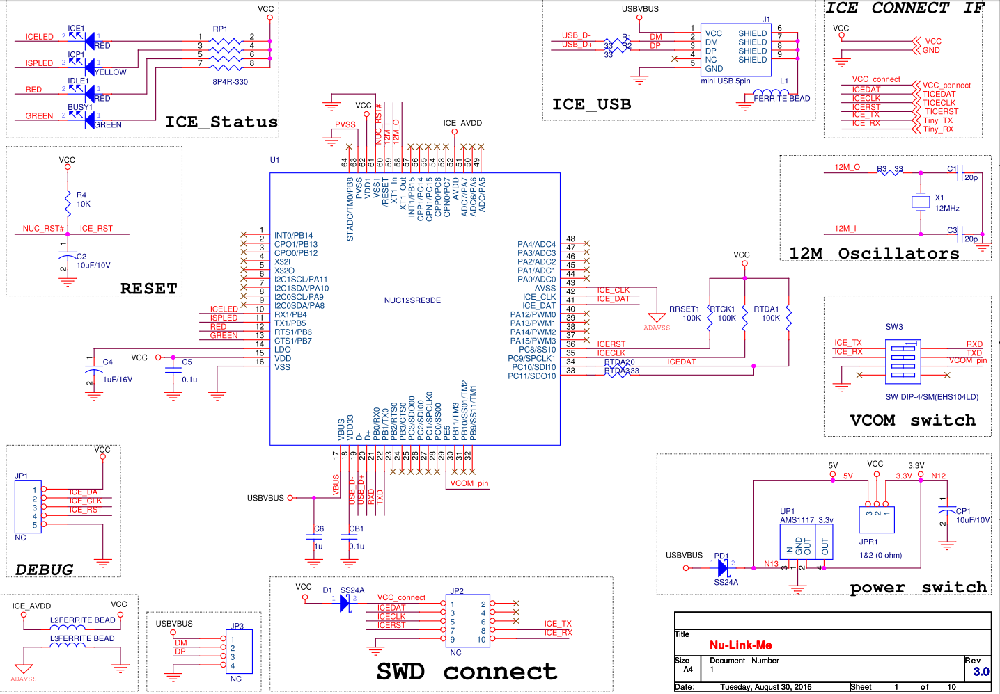
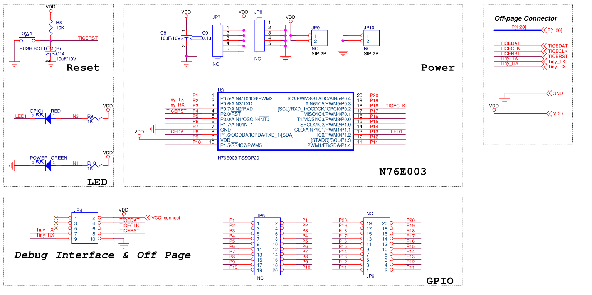

# nuLink-dat

- 5V
- DAT
- CLK 
- RST 
- GND 

recognized as NU-Link USB 

read chips via [[ICP-dat]]

## ICP options 

- [[ICP-dat]] - [[programming-dat]]

Flash our [[DOD1077-dat]] board 

## Hardware 

- NUC12SRE3DE

### SCH 

SCH 1 

SCH 2

## ref 

- [[UM_NuTiny-SDK-N76E003_EN_Rev1.00.pdf]]