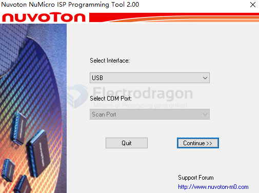
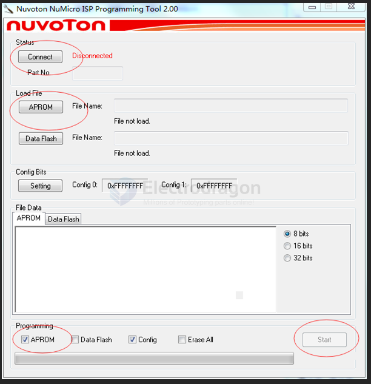
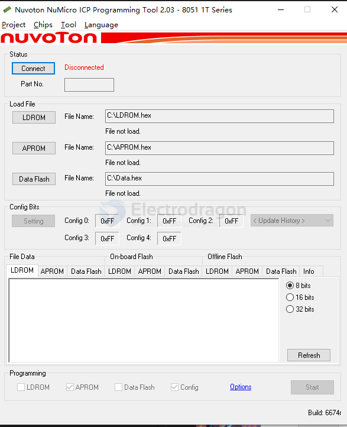

# nuvoton-dat

- legacy wiki page - https://w.electrodragon.com/w/Category:Nuvoton

## Chips 

- [[n76e003-dat]]

N79E825A/824A/823A/822A DataSheet

8051
* MS51FB9AE

* N76E616 0 C51 with LCD Driver

NUC029 

http://www.nuvoton.com.cn/products/microcontrollers/arm-cortex-m0-mcus/nuc029-series/

* NUC029SEE芯片（LQFP64)
* NUC029SDE
* NUC029LAN 芯片(LQFP48)
* NUC029FAE 芯片(TSSOP20)

* NUC100RD2DN 芯片(LQFP64)

* NUC130RC1CN 芯片(LQFP64)
* NUC131LC2AE LQFP-48

* NUC240VE3AE 芯片(LQFP100)

* NUC505DL13Y 芯片(LQFP48) - https://github.com/robbie-cao/nuc505

Linux
* NUC972DF62 - [[NUC972-dat]]

NUC980 - ARM9
* NUC980DK61YC
* NUC980DF71YC 芯片 (LQFP216)

## APP / Programmer 

- [[nulink-dat]]

https://www.nuvoton.com.cn/tool-and-software/software-tool/programmer-tool/

## Software 

https://github.com/OpenNuvoton/ISPTool/releases/tag/v4.15

- [NuMicro ICP Programming Tool 2.00.6561.exe](https://electrodragon.com/NuMicro_ICP_Programming_Tool_V2.00.6561.zip)

- [[programming-dat]]

### NuMicro ISP Programming Tool

- The factory module comes with LDROM and supports serial port downloading. 
- Note that the serial port currently only supports .bin format files. 
- If it is in other formats, please convert it to a .bin format file. We provide a conversion tool in the download tool. 

- [[ISP-dat]] toosl == Nuvoton NuMicro ISP Programming Tool.

- NuMicro ISP Programming Tool V4.15

- Click to connect the device (if it cannot be connected, please press the reset button), 
- after successful connection, load the data into APROM, check the file(s) to be programmed, 
- click start, and the module will begin to download the program.

### NuMicro ICP Programming Tool

- [[ICP-dat]]

## repo

- https://github.com/OpenNuvoton

- https://github.com/Edragon/Nuvoton-NUC972
- https://github.com/Edragon/nuvoton-m0
- https://github.com/Edragon/Nuvoton
- https://github.com/Edragon/nuc505
- https://github.com/Edragon/nuvoton-8051 - [[N76E003-dat]]
- https://github.com/Edragon/nuvoton-app
- https://github.com/Edragon/nuvoton-ARM9
- 
## ref 

- [[8051-dat]]

