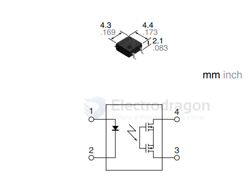

# AQY212-dat.md

FEATURES

1. Greatly increased load current in the same, miniature, 4-pin SO package (1.25A high capacity type added).
2. Greatly improved specs allow you to use this in place of mercury and mechanical relays.

TYPICAL APPLICATIONS
- Measuring instrument market
- Crime and fire prevention market (use in I/O for alarm and security devices, etc.)

- [[ZXTR2005K-dat]] - [[diodes-dat]] - SCH at [[LDO-dat]] - [[XL4301-dat]] - [[AQY212-dat]] - [[dcdc-down-dat]] - [[XL-dat]] - [[mosfet-photo-dat]] - [[mosfet-dat]] - [[panasonic-dat]]

## ref 

