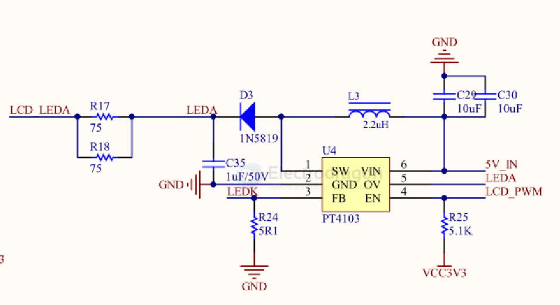
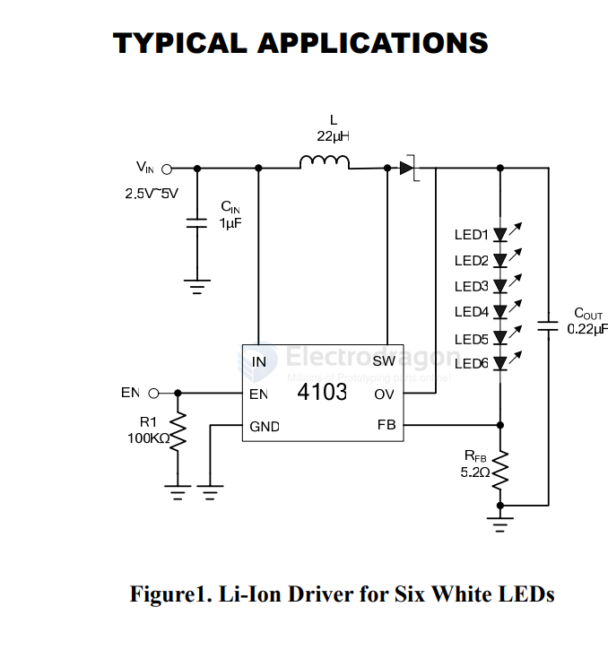

# PT4103-dat

White LED Step-Up Converter

The PT4103 is a step-up DC/DC converter designed for driving up to 8 white LEDs in series from a single cell Lithium Ion battery with constant current. 

Because it directly regulates output current, the PT4103 is ideal for driving light emitting diodes (LEDs) whose light intensity is proportional to the current passing through them, not the voltage across their terminals. 

A single external resistor sets LED current between 5mA and 20mA, which can then be easily adjusted using either a DC voltage or a pulse width modulated (PWM) signal. 

Its low 104mV feedback voltage reduces power loss and improves efficiency. The OV pin monitors the output voltage and turns off the converter if an over-voltage condition is present due to an open circuit condition. The PT4103 is available in SOT23-6 packages.

## display backlight control 

control by LCD_PWM 

## application circuit

## ref 

- [[powtech-dat]] - [[PT4103-dat]] - [[PT4115-dat]]