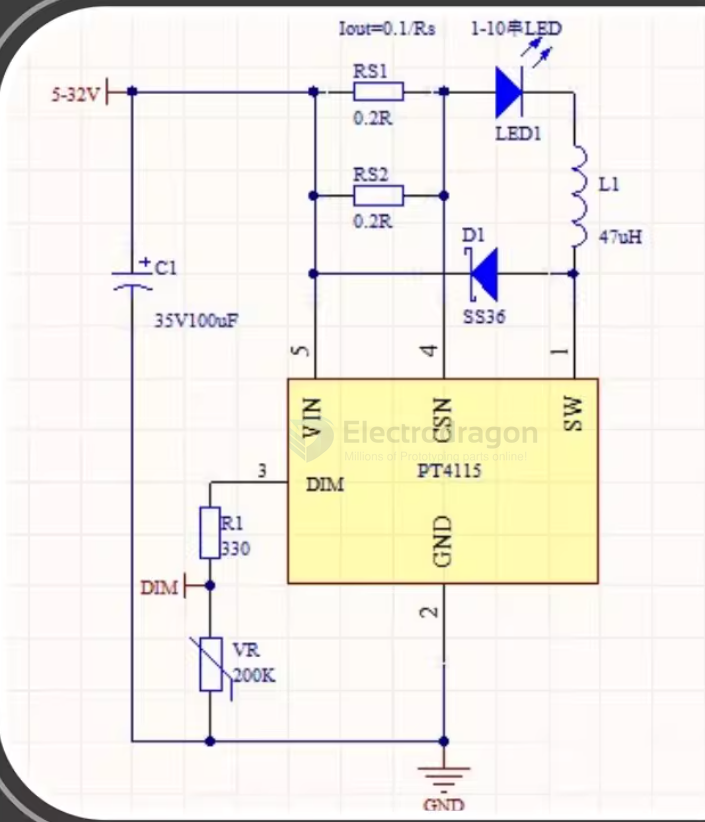

# PT4115-dat 

[[PT4115E-datasheet.pdf]]

The PT4115 is a continuous conduction mode inductive step-down converter, designed for driving single or multiple series connected LED efficiently from a voltage source higher than the total LED chain voltage. 

The  device  operates  from  an  input  supply  between  6V and  30V  and  provides  an  externally  adjustable  output current  of  up  to  1.2A.  

Depending upon  the  supply voltage and external components, the PT4115can provide more than 30 watts of output power.

Iout = 0.1/ Rs 

- Rs >= 0.082R

Iout = 0.1/0.142241 = 0.7030 A 

## SCH2 

## ref 

- [[powtech-dat]] - [[PT4103-dat]] - [[PT4115-dat]]