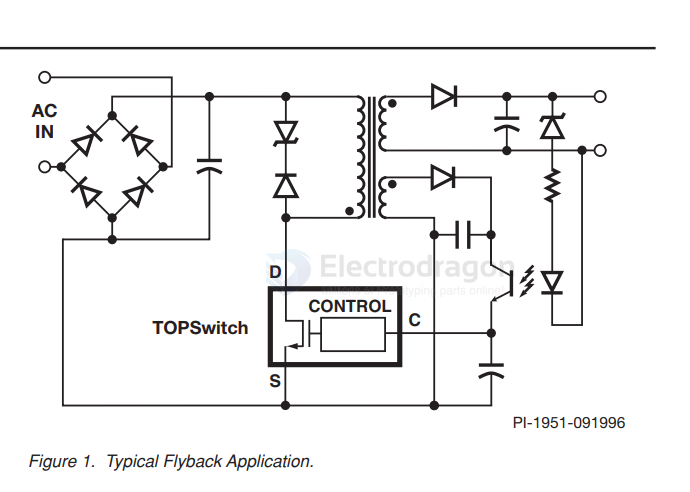

# power-integrations-dat

- LNK302/304-306 LinkSwitch-TN Family - Lowest Component Count, Energy-Efficient Off-Line Switcher IC

- [TOP221-227 - TOPSwitch-II Family - Three-Terminal Off-Line PWM Switch](https://www.power.com/sites/default/files/documents/top221-227.pdf)

Output Power Table

TO-220 (Y) Package1

| PART ORDER NUMBER | Single Voltage Input 3100/115/230 VAC ±15% | Wide Range Input 85 to 265 VAC |
| ----------------- | ------------------------------------------ | ------------------------------ |
|                   | P, MAX 4,6                                 | P, MAX 4,6                     |
| TOP221YN          | 12W                                        | 7W                             |
| TOP222YN          | 25 W                                       | 15W                            |
| TOP223YN          | 50 W                                       | 30 W                           |
| TOP224YN          | 75 W                                       | 45 W                           |
| TOP225YN          | 100 W                                      | 60 W                           |
| TOP226YN          | 125 W                                      | 75 W                           |
| TOP227YN          | 150 w                                      | 90 W                           |

## ref 

- [[ac-mains-dat]]