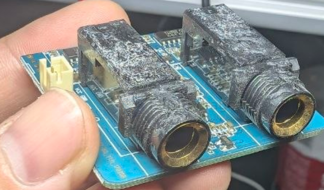
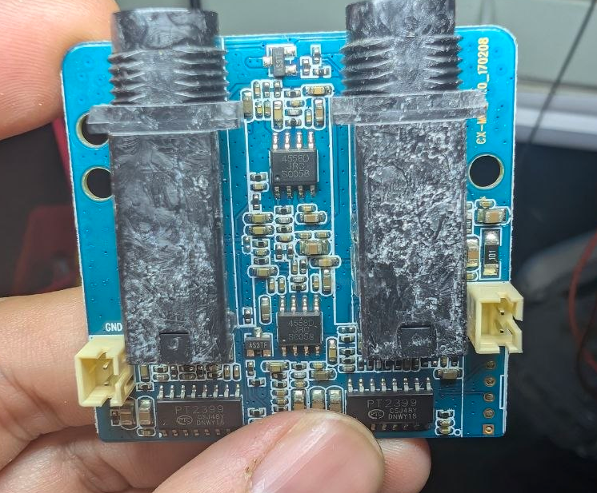
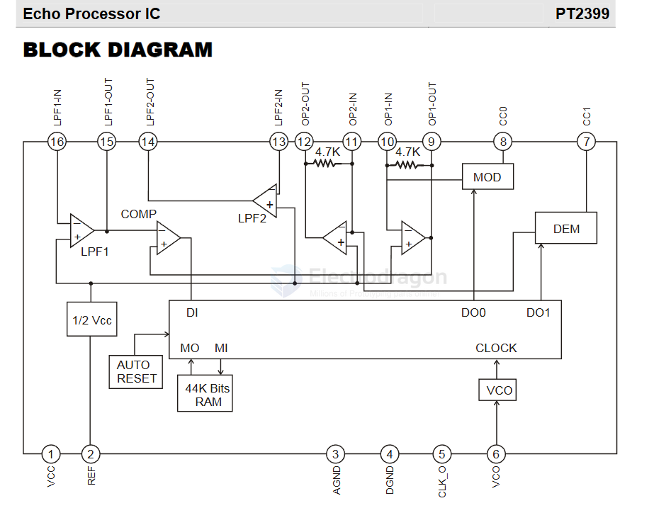

# PT2399-dat

- [[PT2399-dat]] - [[Princeton-dat]]

The PT2399 is a single-chip echo and delay processor IC created by Princeton Technology Corp that uses CMOS technology to combine an analog-to-digital converter (ADC), 44Kb of internal RAM, and a digital-to-analog converter (DAC).

DESCRIPTION
PT2399 is an echo audio processor IC utilizing CMOS Technology which is equipped with ADC and DAC, high sampling frequency and an internal memory of 44K Digital processing is used to generate the delay time, it also features an internal VCO circuit in the system clock, thereby, making the frequency easily adjustable. 

PT2399 boast of very low distortion (THD<0.5%) and very low noise (No<-90dBV), thus producing high quality audio output. The pin assignments and application circuit are optimized for easy PCB layout and cost saving advantage.

FEATURES
• CMOS Technology
• Least External Components
• Auto Reset Function
• Low Noise, No<-90dBV Typical
• Low Distortion, THD<0.5% Typical
• External Adjustable VCO
• Available in 16 pins, DIP or SOP

APPLICATIONS
• Video Tape Recorder
• Video Compact Disk
• Television
• CD Player
• Car Stereo
• KARAOKE Mixer
• Electronic Musical Instrument
• Audio Equipment with Echo Processor 

## build 

45S8D - [[JRC-dat]] - [[JRC4558D-dat]] - [[amplifier-dat]] - [[amplifier-audio-dat]] - main [[PT2399-dat]] - [[Princeton-dat]]

## diagram 

## ref 

datasheet = [[PT2399.pdf]]