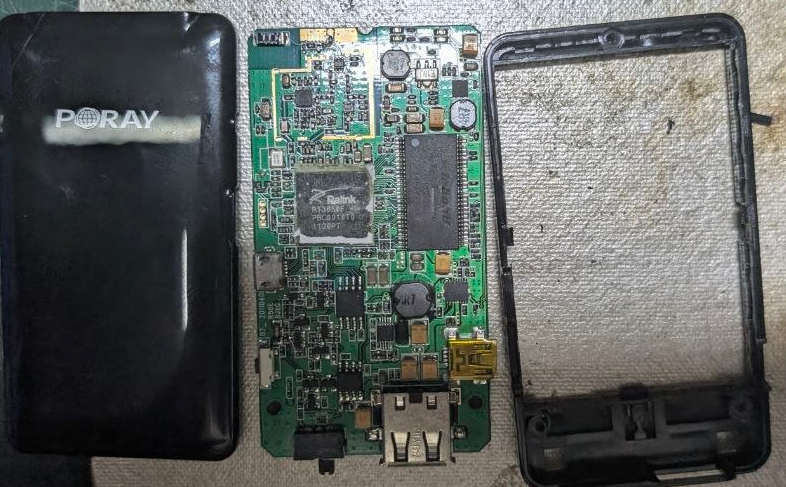
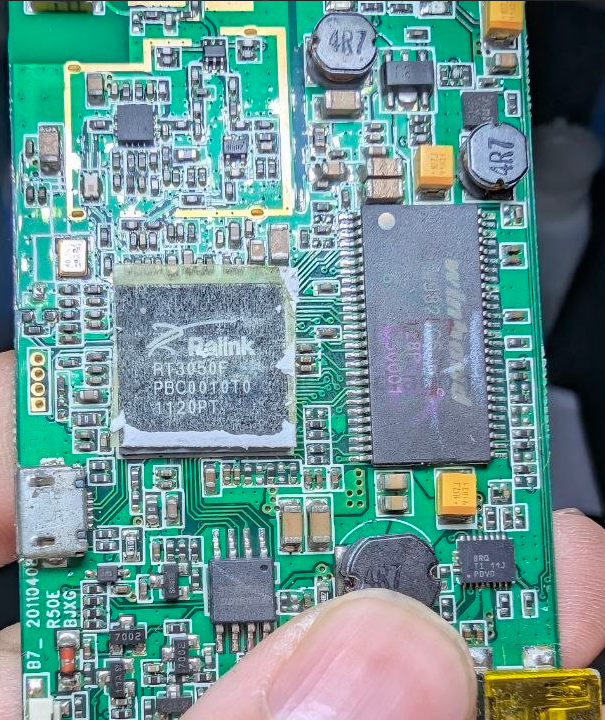
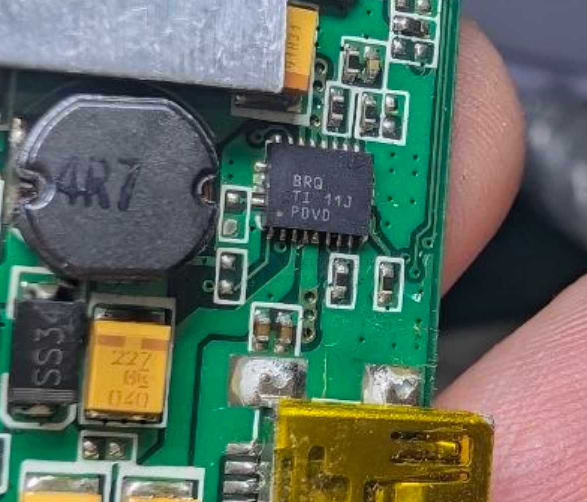
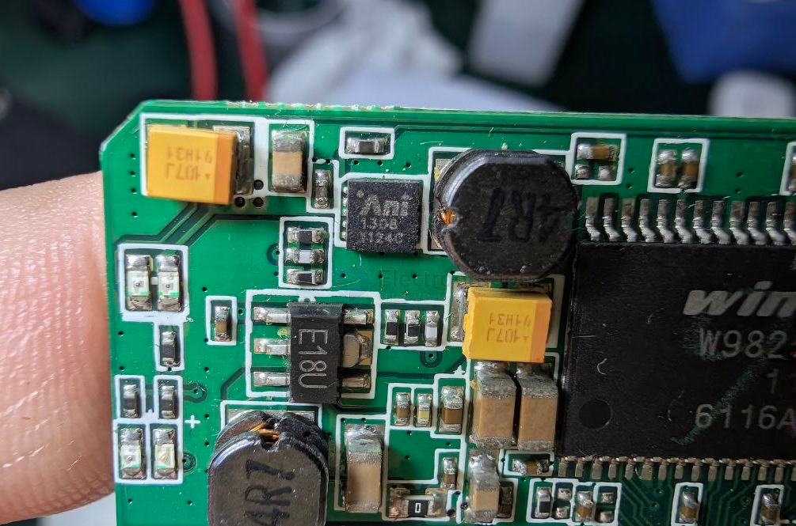
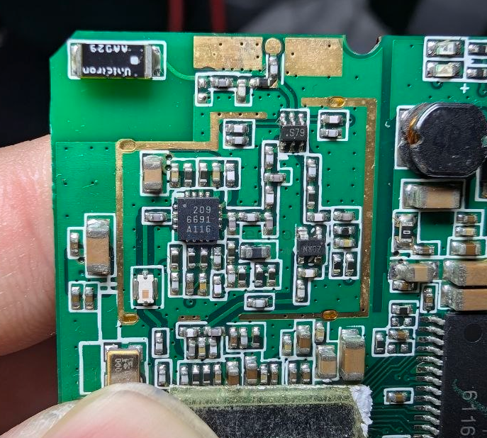

# RT3505-dat

- [[mosfet-dat]]

- [[power-dat]] == BRG T1 11J P0VD PDVD 

- [[AX5510-dat]] 

ANI 1308 

- [[network-dat]] == 209 6691 a116 chip qfn

- [[DDR-dat]] - [[memory-dat]] - [[flash-dat]]

