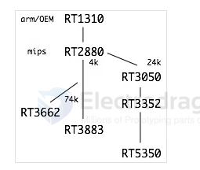

# ralink-dat

- [[ralink-dat]] - [[Atheros-dat]] - [[Broadcom-dat]]

Then, in 2008, the company's most successful SOC, the RT3050/52, was released. This SOC was used in a great many routers and other devices, bringing about a change in the MIPS SOC market, which had been dominated by [[Atheros-dat]] and [[Broadcom-dat]]. 

The RT3050 used MIPS 24K and integrated the RF chip, which was external in the RT2880. 

The RT3050's widespread adoption is thought to be due to its support for 11n, its Flash memory's compatibility with both CFI and SPI, and its USB support.

The RT3050 includes DSP(r1) functionality that is not present in Atheros' 24K chips.

The `RT5350` was released in 2011, and was later acquired by Mediatek. Even after becoming Mediatek, the RT5350 and other products were apparently still sold under the Ralink brand.

Ralink has few SOC chips that support 5G with 11n. The first `RT2880` could be used with an external RF, and the later `RT3662` and `RT3883` seem to have had built-in 5G RF. The RT3662 and RT3883 also seem to have a different architecture with MIPS 74K.

- [[RT3505-dat]]

- [[RT5350-dat]]

- [[RT3092-dat]]

## ref 