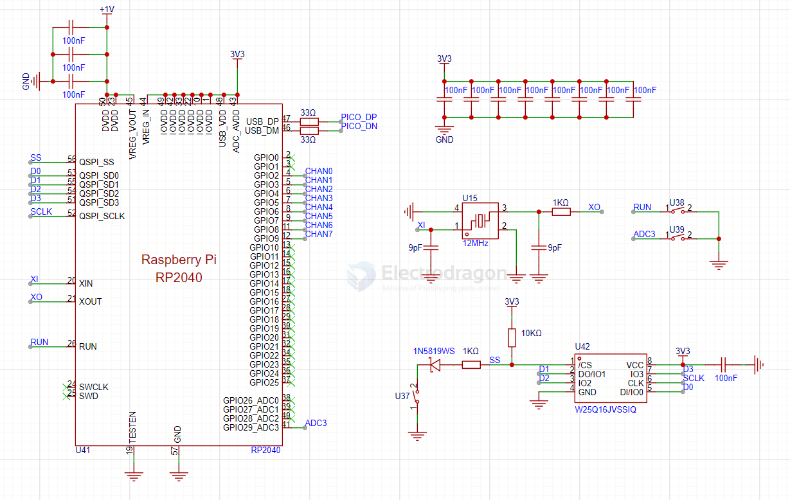

# RP2040-dat

- Dual-core Arm Cortex-M0+ processor, up to 133 MHz
- 264 KB on-chip SRAM
- Support for up to 16 MB of external QSPI flash
- USB 1.1 controller and PHY, device and host support
- 30 multifunction GPIO pins
- 2 × UART, 2 × SPI, 2 × I2C, 16 × PWM channels
- 3 × 12-bit ADC channels
- Programmable I/O (PIO) for custom peripheral support
- On-chip clock and PLL
- Low-power sleep and dormant modes
- Temperature sensor
- 8 × ground pins, 4 × ADC pins
- Built-in ROM with USB bootloader
- 2 × watchdog timers, real-time counter
- 2 × timer peripherals
- 3.3V operation

逻辑分析仪采用的是基于树莓派RP2040的方案，支持八通道（原方案是24通道，本项目引出了八通道）最大100MHz采样率，外挂FLASH为W25Q16JVSSIQ，2MB容量。

## min. Core SCH 

## ref 

- [[raspberry-pi-dat]]