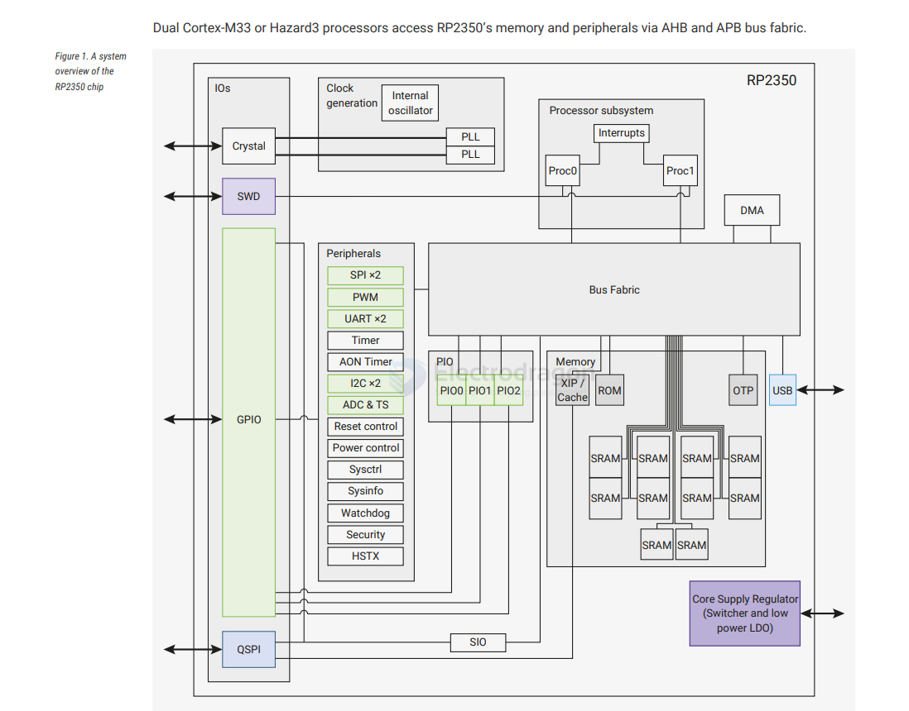
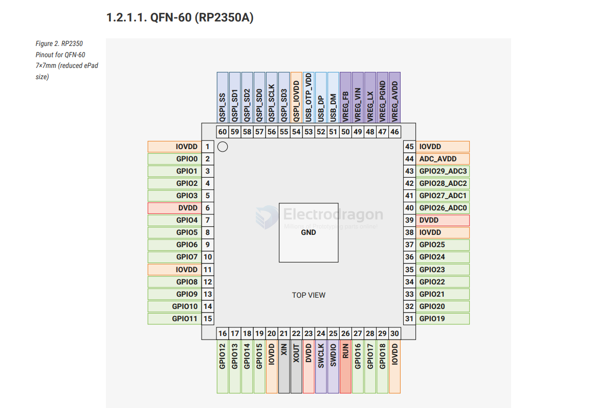

# RP2350-dat

[datasheet](https://datasheets.raspberrypi.com/rp2350/rp2350-datasheet.pdf) 

- [[ARM-dat]]

- [[peripherals-dat]]

## pins and footprint 

## chip info

RP2350 is a high-performance, secure, low-cost, and easy-to-use microcontroller launched by Raspberry Pi.

It features large on-chip memory, a symmetric dual-core processor, a deterministic bus structure, and a rich set of peripherals. It is also equipped with our unique Programmable I/O (PIO) subsystem, providing unparalleled power and flexibility for professional users. RP2350 offers detailed documentation, a complete MicroPython port, and a UF2 bootloader in ROM, providing the lowest entry barrier for beginners and hobbyists.

RP2350 is a stateless device that supports execute-in-place (XIP) from external QSPI memory. This design allows you to choose the appropriate density of non-volatile storage for your application and benefit from the low prices of commodity flash components.

RP2350 is manufactured using a modern 40nm process node, featuring high performance, low dynamic power consumption, and low leakage. It also offers multiple low-power modes to support long-term operation on battery power.

Main features include:

- **Dual Cortex-M33 or Hazard3 processors, up to 150MHz**
- 520KB multi-bank high-performance SRAM
- Supports up to 16MB external flash via dedicated QSPI bus
- DMA controller
- Fully connected AHB crossbar switch
- On-chip programmable LDO for core voltage generation
- 2 on-chip PLLs for generating USB and core clocks
- 30 GPIO pins, 4 of which can be used as analog inputs
- 2 UARTs
- 2 SPI controllers
- 2 I2C controllers
- 24 PWM channels
- USB 1.1 controller and PHY, supporting host and device modes
- 3 Programmable IO (PIO) blocks, with a total of 12 state machines

Security:

RP2350 features a comprehensive security architecture built around Arm TrustZone for Cortex-M, including the following features:

- Supports secure boot with signature verification
- 8KB on-chip anti-fuse One-Time Programmable (OTP) memory
- SHA-256 accelerator
- Hardware True Random Number Generator (TRNG)

Architecture switching:

RP2350 includes a pair of open hardware Hazard3 RISC-V cores, which can replace the Cortex-M33 cores at boot. Our boot ROM can even automatically detect the architecture of the built second-stage binary and reboot the chip into the corresponding mode. Except for a small number of security features and the double-precision floating-point accelerator, all chip functions are available in RISC-V mode.

## ref 

- [[raspberry-pi-dat]]