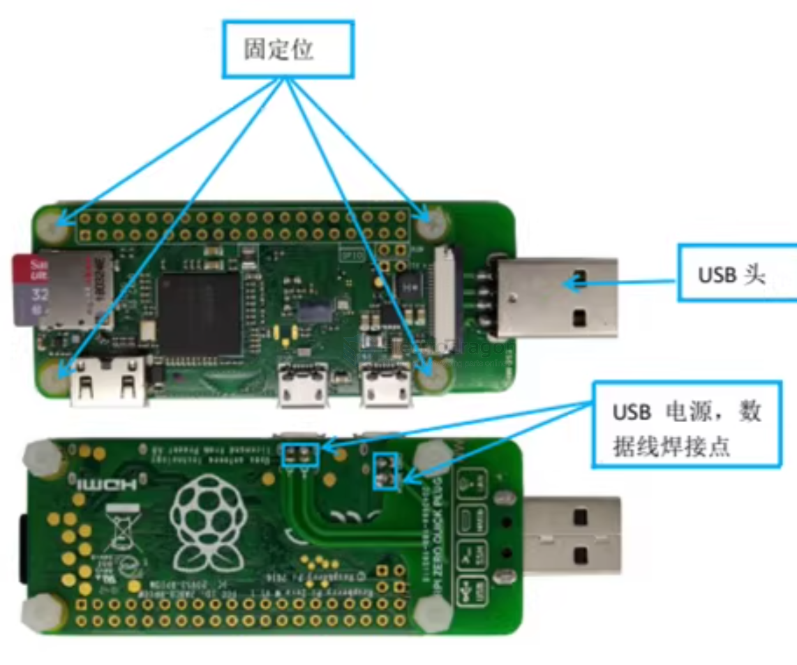
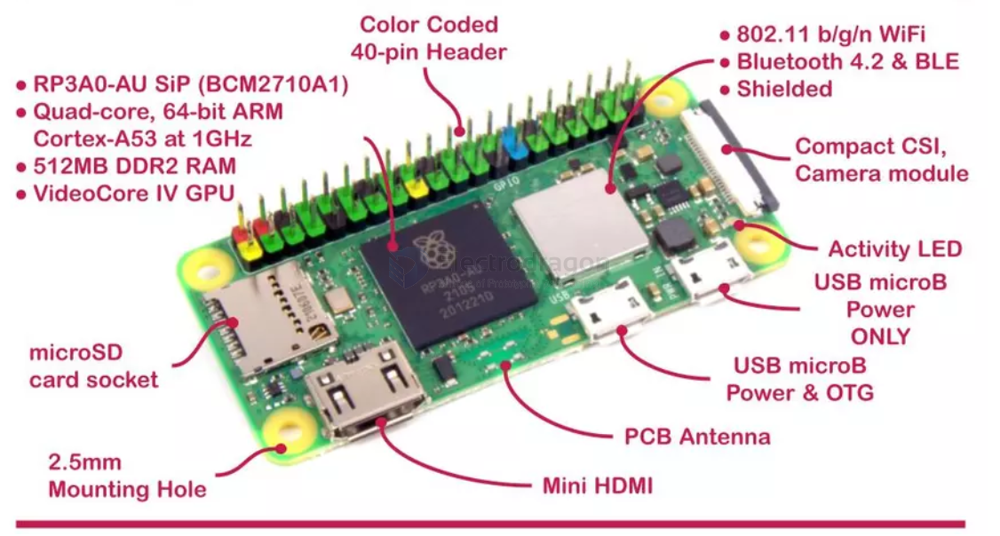

# RPI-zero-dat

- [[SBC-dat]] - [[RPI-SBC-dat]] (raspberry pi) - [[RPI-zero-dat]]

## apps 

- [[rubyFPV-dat]] 

* **[Pi-hole](https://github.com/pi-hole/pi-hole)**: A DNS-based network-wide ad blocker that protects all connected devices from advertisements and tracking.
* **[RetroPie](https://github.com/RetroPie/RetroPie-Setup)**: Turns your micro-computer into a retro gaming console supporting dozens of classic gaming systems and controllers.
* **[TeslaUSB](https://github.com/marcone/teslausb)**: Emulates a smart USB drive for Tesla Dashcam and Sentry Mode, automatically archiving clips to a home server or cloud storage over Wi-Fi.
* **[PiSugar](https://github.com/PiSugar/PiSugar)**: Open-source hardware and software companion suite designed for managing portable power management modules and batteries on Pi Zero setups.
* **[motionEyeOS](https://github.com/motioneye-project/motioneyeos)**: A Linux distribution that turns a Pi Zero with a camera module into a full-featured video surveillance and motion-detection camera server.
* **[GassistPi](https://github.com/shivasiddharth/GassistPi)**: Integrates Google Assistant voice-control capabilities onto single-board computers using custom audio components.
* **[Uptime Kuma](https://github.com/louislam/uptime-kuma)**: A self-hosted, lightweight monitoring tool with a slick dashboard to check the status of websites, services, and local servers.
* **[PiKVM (V3/V4 Open-Source elements)](https://github.com/pikvm/pikvm)**: Low-cost open-source KVM-over-IP solution that can leverage Pi hardware variants for remote machine management and OS re-installations.
* **[WireGuard / Tailscale setups](https://github.com/tailscale/tailscale)**: Lightweight mesh VPN implementation allowing secure, encrypted remote access back to your home local network.
* **[MagicMirror²](https://github.com/MagicMirrorOrg/MagicMirror)**: An open-source modular smart mirror platform used to display live weather, calendars, and news feeds behind a two-way glass.
* **[PiClock](https://github.com/code-a-saurus/PiClock)**: A bedside smart clock application utilizing I2C 7-segment displays, NTP time sync, and HomeKit integration.
* **[Pi-Car / Oomwoo (Robotics framework)](https://github.com/makerspet/oomwoo)**: Open-source software stacks designed to control small-scale robotic chassis, sensor arrays, and differential drive systems.
* **[Klipper (via KlipperScreen / client nodes)](https://github.com/Klipper3d/klipper)**: Advanced 3D printer firmware ecosystem where auxiliary Pi Zeros are frequently deployed as lightweight companion host nodes or web interface bridges.
* **[OpenHD / Ruby FPV companion nodes](https://github.com/OpenHD)**: Low-latency digital video transmission frameworks that can deploy lightweight components for experimental long-range FPV telemetry and video routing.
* **[Pi-Stomp / Loopa](https://github.com/ferluht/loopa)**: Portable audio computer and software synthesizer toolchains built for musicians utilizing real-time audio processing overlays.
* **[WLED (Client Bridges)](https://github.com/Aircoookie/WLED)**: Though primarily running on ESP chips, Pi Zeros often serve as local MQTT/Home Assistant bridge controllers to sync ambient LED lighting effects.
* **[E-Paper / E-Ink Information Dashboards](https://github.com/waveshare/Edge-EPD)**: Python-driven utilities that pull real-time weather, stock tickers, or transit schedules onto ultra-low-power e-reader displays.
* **[Navidrome](https://github.com/navidrome/navidrome)**: A lightweight, self-hosted music streaming server compatible with Subsonic clients, perfect for turning a Pi Zero into a personal headless jukebox.
* **[Gitea](https://github.com/go-gitea/gitea)**: A painless, self-hosted lightweight Git service written in Go, allowing developers to host private code repositories locally on low-power hardware.
* **[Pi-Zero USB Gadget Keystroke Injectors (P4wnP1 / MaMe82 suite)](https://github.com/RoganDawes/P4wnP1)**: Advanced security auditing and USB-HID gadget testing frameworks that leverage the Pi Zero's USB On-The-Go capability.

## USB Extent 

## info Zero 2W

【Raspberry Pi Zero 2W Features】

- Broadcom BCM2710A1, 1GHz quad-core 64-bit Arm Cortex-A53 CPU
- 512MB LPDDR2 SDRAM
- 2.4GHz 802.11 b/g/n wireless LAN
- Bluetooth 4.2, Bluetooth Low Energy (BLE), onboard antenna
- Mini HDMI-compatible port and micro USB On-The-Go (OTG) port
- microSD card slot
- CSI-2 camera connector
- HAT-compatible 40-pin header footprint (unpopulated)
- Micro USB power
- Composite video and reset pins via solder test points
- H.264, MPEG-4 decode (1080p30); H.264 encode (1080p30)
- OpenGL ES 1.1, 2.0 graphics

## Common Needed Accessories 

- micro HDMI cable or converter 
- microUSB expansion USB hub or cable 
- MicroUSB power cable 

## ref 

- [[RPI-HDK-dat]] - [[RPI-SBC-dat]]