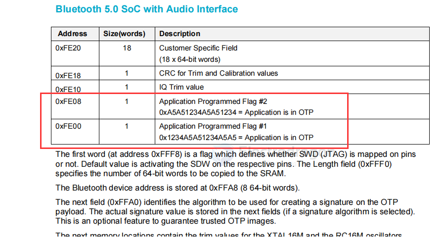
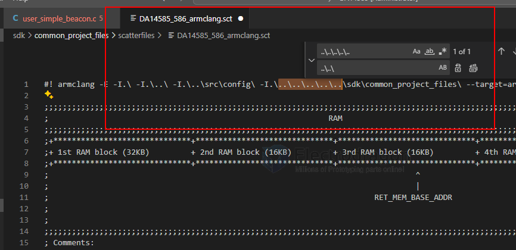

# da14585-dat

- [[MDK-ARM-dat]]

## project 

- [[epaper-dat]]

墨水屏接口：

- BUSY → P2_0
- RST → P0_7
- DC → P0_5
- CS → P2_1
- SDI → P0_6
- SCK → P0_0
- PED_POWER → P2_3

闪灯IO口：

D1 → P2_5

## board 

## functions 

- [[BLE-dat]]

## programming 

tool needed: - [[MDK-ARM-dat]] - [[JLINK-dat]] - [[SmartSnippets-Toolbox-dat]]

- [[Dialog-dat]] - optional new tools - [[renesas-dat]] 

wiring == 

Connect the 3V, GND, SWCLK, and SWDIO pins on the DA14585 development board to the J-Link programmer.

There are several ways to run firmware on the DA14585:

1. Use a computer to download the firmware into the chip's internal RAM for execution, but the firmware will be lost when power is removed.

2. Connect external flash to the DA14585. Use a computer to program the firmware into the FLASH. When the chip is powered on, it will read the firmware from flash into RAM for execution. - [[flash-dat]]

3. Use a computer to program the firmware into the chip's internal OTP, but OTP can only be programmed once, so it is generally used in the final stage of project development. - [[OTP-dat]]

4. Connect the DA14585 to an external MCU via UART. The 585's firmware is stored in the MCU, and the MCU writes the firmware into the 585's RAM and runs it according to a specific timing sequence.

### Configure flash pins

Why do you need to configure the FLASH pins for programming? Here is a brief explanation, as shown in the figure below. This is because the DA14585 chip has 64KB of OTP memory inside, which means that if you program the chip, you can only do it once. During development, you inevitably need to debug and program repeatedly. How do you solve this?

Usually, a FLASH chip is included. During the debugging phase, code is programmed into the FLASH, allowing for repeated debugging and programming. The SDK also provides library files for booting the chip from FLASH. You just need to configure the relevant macro definitions, which is very convenient, as shown in the figure below. Once the code is stable and the product is ready for mass production, the FLASH can be removed, and the code can be programmed into the OTP memory. (PS: This is probably why the DA14585 is cheaper than Nordic.)

## boot mode 

### OTP mode 

烧录完OTP Image文件后还没有完，还需要设置程序从OTP启动，这里点击OTP Header进行设置，将Application Programmed Flag #1、Application Programmed Flag #2设置为Yes，OTP DMA length设置为0x1FFF，not OTP mode  as 如下。

通过搜索DA14585的烧录教程，发现芯片通过jlink的SWD接口编程，通过SmartSnippets Toolbox上位烧录软件烧录到外部flash启动，

并非一定要烧录OTP才能运行，所以到这里不好判断芯片是否OTP启动。

芯片手册介绍如果OTP Header标志位设置OTP启动就无非再次使用。

### flash mode 

## SDK 

examples 

6.0.12.1020.2\SDK\6.0.12.1020.2\projects\target_apps\ble_examples\prox_reporter\Keil_5

## info 

SmartBond™ Bluetooth 5.0 SoC with Audio Interface

https://www.renesas.com/en/products/da14585?srsltid=AfmBOooWcV8GNAtOiG36Kzq7uH3nPqsYVx7_c973Kwi16WvqebZ1ooP3#overview

Benefits
- Large memory to build complex applications
- Longest battery life
- Low system Bill of Materials (BOM)

Packages
QFN-40 (5.0mm x 5.0mm x 0.9mm)
WLCSP-34 (2.4mm x 2.66mm x 0.39mm)

datasheet 

https://www.renesas.com/en/document/dst/da14585-datasheet?r=1600291

The DA14585 is an ultra-low power SoC integrating a 2.4 GHz transceiver and an ARM Cortex-M0™
microcontroller with 96 kB of RAM and 64 kB of One-Time Programmable (OTP) memory. It offers a
very fast boot time (<50 ms) and supports up to 8 Bluetooth® LE connections. It can be used as a
standalone application processor or as a data pump in hosted systems.

The radio transceiver, the baseband processor, and the qualified Bluetooth® LE stack is fully
compliant with the Bluetooth® Low Energy 5.0 standard.

The DA14585 has dedicated hardware for the Link Layer implementation of Bluetooth® Low Energy
and interface controllers for enhanced connectivity capabilities.

The Bluetooth® Low Energy firmware includes the L2CAP service layer protocols, Security Manager
(SM), Attribute Protocol (ATT), the Generic Attribute Profile (GATT) and the Generic Access Profile
(GAP). All profiles published by the Bluetooth® SIG as well as custom profiles are supported.

The device is suitable for remote control units (RCU) requiring support for voice commands, wireless
sensor nodes, Bluetooth® Mesh applications, fitness trackers, toys, and HID devices (keyboards,
mice, and so on).

## pin definitions and hacked TP pins 

A Quad Flat Package No Leads (QFN) with 40 pins

## common test point 

- [[test-point-dat]]

| Test Point | Pin Number(s) | Signal  |               |
| ---------- | ------------- | ------- | ------------- |
| TP3        | 38            | VDD     | 0.8V ~~1.8 V~~         |
| TP1        | 14/15         | VBAT    | 2.0 V – 3.6 V |
| TP7        | 6             | UART_TX |               |
| TP8        | 7             | UART_RX |               |
| TP2        | GND           | GND     |               |
| TP4        | 17            | RST     |               |
| TP6        | 25            | SWDIO   |               |
| TP5        | 26            | SWCLK   |               |

## MCU SCH 

purpose for [[epaper-dat]]

## programmer

https://github.com/ezflash/ezFlashCLI

[[e2-studio-dat]] - [[sdk-dat]]

SmartBond™ standalone flash programmer

smartbond-flash-programmer == 
https://www.renesas.com/en/software-tool/smartbond-flash-programmer?srsltid=AfmBOoqIz_uaAlOoy31vQh5kaQYAubxY6fg9KkIMYeT-_uUZPFdgYSZL#downloads

## external memrory programming 

https://www.renesas.com/en/document/apn/b-055-da14585-interfacing-external-memory

## SDK examples 

First, download the SDK from the Renesas website. == [SDK6.0.22.1401 for DA1453x, DA14585/6](https://www.renesas.com/en/document/swo/sdk60221401-da1453x-da145856)

- https://github.com/renesas/ble-sdk6-examples

run example of simple-beacon result, use tools - [[BLE-dat]]

- https://lpccs-docs.renesas.com/DA14585_Getting_Started_basic/06_Your_First_DA1585x_Applications/Your_First_DA1585x_Applications.html

- [[jlink-dat]]

- https://www.renesas.com/en/document/mat/um-b-048-da14585-da14586-getting-started-guide-basic-development-kit-pdf?srsltid=AfmBOoqhNeOJ4iqcPyVboJm2gjWzjhR-Eu-Sru8aNj38RZPM9GJjcgHH

The Basic Kit includes an embedded J-Link debugger which allow easy communication with the
development host over USB.

The DA14585/586 SoC is configured only in Buck mode on this development kit. A choice can be made
between 3.3 V (via USB: J5 1-2) or VDD (a coin cell: J5 2-3). No battery is needed when running via
the mini-USB cable.

Note: The basic Kit is connected to the host PC over the connector marked as USB (J3), as
shown in Figure 6 using a standard mini-USB cable.

- [[JLINK-dat]] - [[DPR1135-dat]] - [[serial-dat]] - [[SWD-dat]]

- The installation procedure for SmartSnippets™ Studio is described in detail in UM-B-057
SmartSnippets Studio User Manual.

- [[MDK-ARM-dat]]

## common error 

keep all the file in well oranized: 

check all the file includes DA14585_586_armclang.sct

## correct file setup 

## correct file structures 

## app 

- [[epaper-dat]]