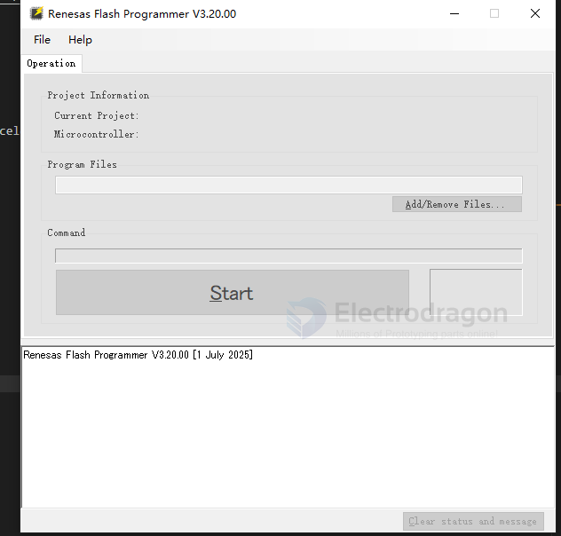

# Renesas-dat

HIN202E, HIN206E, HIN207E, HIN208E, HIN211E, HIN213E, HIN232E
±15kV, ESD-Protected, +5V Powered, RS-232 Transmitters/Receivers

https://www.renesas.com/en/document/dst/hin202e-hin206e-hin207e-hin208e-hin211e-hin213e-hin232e-datasheet

- [[da14585-dat]]

- [[dialog-dat]]

DA14580 is selected by Xiaomi Bracelet. DA14580 is the world's smallest, lowest power, and most integrated Bluetooth smart SoC.

- [[DA14580-dat]]

- [[MDK-ARM-dat]]

## tools 

Renesas Flash Programmer V3.20.00

