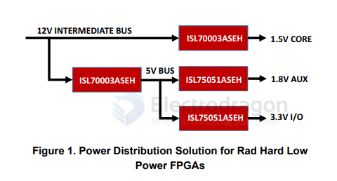
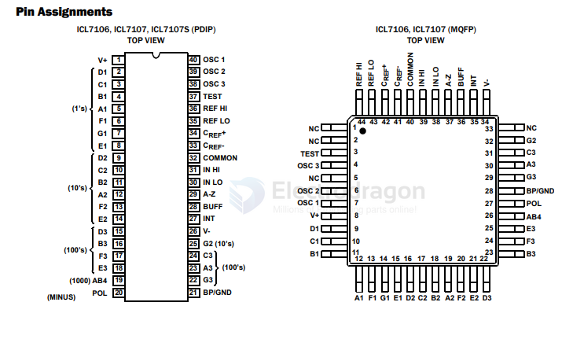

# Renesas-dat

HIN202E, HIN206E, HIN207E, HIN208E, HIN211E, HIN213E, HIN232E
±15kV, ESD-Protected, +5V Powered, RS-232 Transmitters/Receivers

https://www.renesas.com/en/document/dst/hin202e-hin206e-hin207e-hin208e-hin211e-hin213e-hin232e-datasheet

- [[da14585-dat]] - [[da14580-dat]]

- [[dialog-dat]]

DA14580 is selected by Xiaomi Bracelet. DA14580 is the world's smallest, lowest power, and most integrated Bluetooth smart SoC.

- [[DA14580-dat]]

- [[MDK-ARM-dat]]

## digitizer-dat

- [ISL98001 == Triple Video Digitizer with Digital PLL](https://www.renesas.com/en/document/dst/isl98001-datasheet?srsltid=AfmBOorcxnZOdJ4UY-C2hDSI7Bo7-zJHZQ8r79fzwhDIWpt-yjGB9aKx)

The ISL98001 3-Channel, 8-bit Analog Front-End (AFE) contains all the functions necessary to digitize analog YPbPr video signals and RGB graphics signals from DVD players, digital VCRs, video set-top boxes, and personal computers. This product family’s conversion rates support HDTV resolutions up to 1080p and PC monitor resolutions up to UXGA and QXGA, while the front end's programmable input bandwidth ensures sharp, clear images at all resolutions.

## DCDC-down

- [[dcdc-down-dat]] - [[FPGA-dat]] - [[DSP-dat]] - [[digital-dat]]

[Radiation and SEE Hardened 3V to 13.2V, 9A Buck Regulator](https://www.renesas.com/en/document/dst/isl70003aseh-datasheet?srsltid=AfmBOopaNiQGwMdlDdUYURkKmQ59goaSxmAfLGJ7IiCfjQd6GE_l7aJx)

## ADC 

ICL7106, ICL7107, ICL7107S - 3 1/2 Digit, LCD/LED Display, A/D Converters

The ICL7106 and ICL7107 are high performance, low power, 3 1/2 digit A/D converters. Included are seven segment decoders, display drivers, a reference, and a clock. The ICL7106 is designed to interface with a liquid crystal display (LCD) and includes a multiplexed backplane drive; the ICL7107 will directly drive an instrument size light emitting diode (LED) display.

## tools 

- [[SmartSnippets-Toolbox-dat]] 
- [[E2-studio-dat]]
- Renesas Electronics Utilities - Renesas Flash Programmer V3.20
- Renesas SmartBond Flash Programmer v1.0.14

- [[SDK-dat]]

Renesas Flash Programmer V3.20.00

## ref 

- [[chip-dat]]
