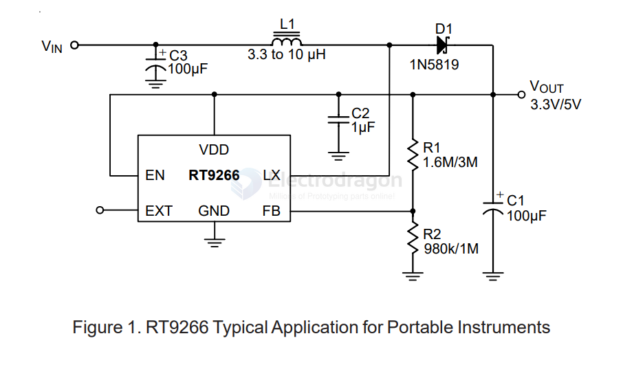

# RT9266-dat

- [[dcdc-boost-dat]]

- [[OPM1000-dat]]

https://www.richtek.com/assets/product_file/RT9266/DS9266-16.pdf

Tiny Package, High Efficiency, Step-up DC/DC Converter

Features
- 1.0V Low Start-up Input Voltage
- High Supply Capability to Deliver 3.3V 100mA with 1 Alkaline Cell
- 17μA Quiescent (Switch-off) Supply Current
- Zero Shutdown Mode Supply Current
- 90% Efficiency
- 450kHz Fixed Switching Frequency
- Providing Flexibility for Using Internal and External Power Switches
- Small SOT-23-6 & SOT-89-5 Package
- RoHS Compliant and 100% Lead (Pb)-Free

## ref 

- [[richtek-dat]]