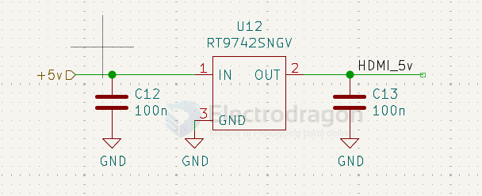

# richtek-dat

- [[dcdc-down-dat]]

## RT9742

70mΩ/55mΩ, 3A/2.5A/2A/1.5A/1A/0.5A High-Side Power Switches with Flag

The RT9742 is a cost-effective, low-voltage, single N-MOSFET high-side Power Switch IC for USB application. Low switch-on resistance and low supply current are realized in this IC.

The RT9742 integrates an over-current protection circuit, a short fold back circuit, a thermal shutdown circuit and an under-voltage lockout circuit for overall protection.

- [[power-protection-dat]]

GGJ5 == 1A 

## RT9080 

- RT9080 - 2μA IQ, 600mA Low-Dropout Linear Regulator

## RT8279 

5A, 36V, 500kHz Step-Down Converter

https://www.richtek.com/assets/product_file/RT8279/DS8279-01.pdf

### Features

-  5A Output Current
-  Internal Soft-Start
-  110mΩ Internal Power MOSFET Switch
-  Internal Compensation Minimizes External Parts Count
-  High Efficiency up to 90%
-  25μA Shutdown Mode
-  Fixed 500kHz Frequency
-  Thermal Shutdown
-  Cycle-by-Cycle Over Current Protection
-  Wide 5.5V to 36V Operating Input Range
-  Adjustable Output Voltage from 1.222V to 26V
-  Available In an SOP8 (Exposed Pad) Package
-  RoHS Compliant and Halogen Free

