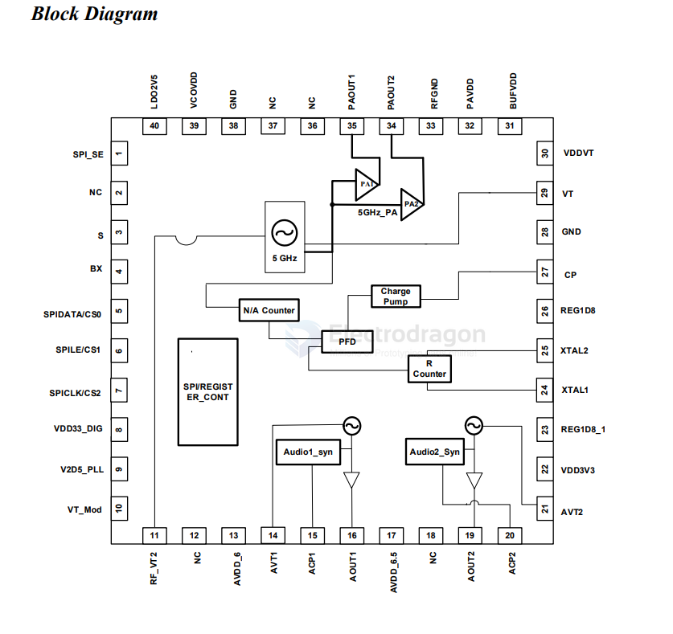
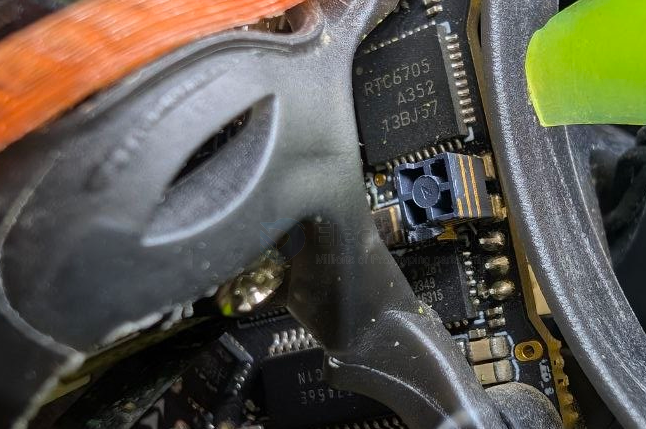

# RTC6705-dat

- [[richwave-dat]] - [[RTC6705-dat]] - [[VTX-dat]] - [[5.8ghz-dat]] - [[radio-dat]] - [[radio-FM-dat]]

`AV05BMP` is the silk-print code for the RTC6705A 5.8GHz wireless analog video transmitter integrated circuit chip. 

The RTC6705 is a wide-band FM transmitter intended for the application on 5.8GHz bands FM
transmission. This chip includes a 5.8GHz band RF modulator, two channels of audio modulator
and internal power amplifier with +13dBm power output referred to external matching network.
The 5.8GHz band RF modulator block, which is frequency-synthesizer based with an integrated
VCO, generates the 5.8GHz band FM signal modulated with video signal and two modulated
audio subcarriers at 6MHz and 6.5MHz respectively. Both Stereo and Mono application are
available on the chip.

Transmission frequency can be set by internal register via SPI programming, or by selecting six
dedicated pins. Two stages output power of +2dBm or +13dBm can be configured via pins 34
and 35. Both CE and FCC regulations are easy to pass by using RTC6705 with application
circuit and single room shielding case. 

## diagram 

## use 

- [[X12-dat]]

## ref 